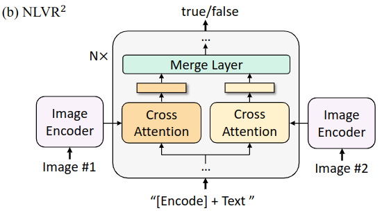

# 多模态学习笔记
source link:https://blog.csdn.net/m0_51976564/article/details/134356373
https://blog.csdn.net/m0_68116052/article/details/143207535


## ViT
vit也是一个encoder only （仿bert）
https://blog.csdn.net/qq_50645064/article/details/145721700
1. 编码器模型 (encoder-based model) 难以完成文本生成任务；编码器 - 解码器模型 (encoder-decoder models)/decoder only无法完成图像文本检索任务。因为decoder为了生成文本或者图像，会为每个token生成embedding用于分类做自回归，在得到全局embedding下不具有优势，因此不利于检索.
2. 图片编码器可以用resnet等也可以用ViT.下图是ViT的结构.
   
   https://blog.csdn.net/qq_37541097/article/details/118242600
3. vit其实很好理解，就是一个用于图片的bert。位置编码与图片同shape随机初始化可学习，也有一个cls，也是多头双向注意力，也是做cls的分类任务。
4. 只不过对于图像的嵌入，在shape上需要注意。：
   1. 对于图像数据而言，其数据格式为[H, W, C]是三维矩阵明显不是Transformer想要的。所以需要先对数据做个变换。如下图所示，首先将一张图片按给定大小分成一堆Patches。以ViT-B/16为例，将输入图片(224x224)按照16x16大小的Patch进行划分，划分后会得到$( 224 / 16 ) ^ 2 = 14^2=196$个Patches。接着通过线性映射将每个Patch映射到一维向量中，以ViT-B/16为例，每个Patche数据shape为[16, 16, 3]通过映射得到一个长度为768的向量（后面都直接称为token）。[16, 16, 3] -> [768]
   2. 在代码实现中，直接通过一个卷积层再把H和W维度拼接成一个维度来实现，则升维后的C是第二维，H和W坍缩成第一维。 以ViT-B/16为例，直接使用一个卷积核大小为16x16，步距为16，卷积核个数为768(每个卷积核刚好覆盖一个patch捕捉则一个16*16的信息，因为步距是16所以得到一个标量；重复768次就可以得到一个向量)的卷积来实现。通过卷积[224, 224, 3] -> [14, 14, 768]，然后把H以及W两个维度展平即可[14, 14, 768] -> [196, 768]，此时正好变成了一个二维矩阵，正是Transformer想要的。
   3. 在输入Transformer Encoder之前注意需要加上[class]token以及Position Embedding。 在原论文中，作者说参考BERT，在刚刚得到的一堆tokens中插入一个专门用于分类的[class]token，这个[class]token是一个可训练的参数，数据格式和其他token一样都是一个向量，以ViT-B/16为例，就是一个长度为768的向量，与之前从图片中生成的tokens拼接在一起，Cat([1, 768], [196, 768]) -> [197, 768]。【多的这一个768的向量就是这一张图片的代表性cls embedding，参考bert】
   4. 然后关于Position Embedding就是之前Transformer中讲到的Positional Encoding，这里的Position Embedding采用的是一个可训练的参数（1D Pos. Emb.），是直接叠加在tokens上的（add），所以shape要一样。以ViT-B/16为例，刚刚拼接[class]token后shape是[197, 768]，那么这里的Position Embedding的shape也是[197, 768]。每个positon 用一个1dimension的向量表示位置编码即可
5. ViT模拟了bert，也有一个cls embedding并且用这个cls embedding送去全连接层做分类或者代表这整个图片。这个cls embedding的position embedding是纯0
6. cls token维度大小为[1, 768]。注意的是，这里采取的是Concat操作。即cat cls token [1, 768]与图像patch [196, 768] -> [197, 768]，得到一个二维矩阵。最终将图像变成维度是[197, 768]，可以看成类似bert的输出一样，每个patch对应一个token。每个token都有自己的embedding，且第一个向量都是cls token。将cls token放在第一位，后面分类也是通过cls token给出。
7. 
## CLIP
https://arxiv.org/pdf/2103.00020
https://blog.csdn.net/weixin_38252409/article/details/133828294
1. CLIP其实本质上还是一个交叉熵损失，是文本和图像的损失的平均值。其中，文本和图像各自都只是cross entropy算损失。在batch内部做交叉熵损失前，由于做了softmax操作，因此分母的求和其实暗自包含了文本i和其余负样本图片的距离求和。因此clip的思想是对比学习损失，但是采用in batch negative的方式将对比学习退化到了交叉熵。前提是batch size要足够大，且batch内部不存在hard negative。

1. CLIP使用了对比学习的方法，即通过正样本（匹配的图像-文本对）和负样本（不匹配的图像-文本对）来训练模型。在训练过程中，模型会尝试最大化正样本对的相似度（比如通过计算余弦相似度），同时最小化负样本对的相似度。
2. 【clip for prediction】CLIP模型在zero-shot学习中表现强大，可以直接用于zero-shot推理，比如将猫的图片emb后，将猪狗猫等类的文本描述也分别emb，计算图片和类别emb之间的相似度，从而进行分类。
3. CLIP-ViT-L/14模型的14表示每个patch的分辨率为14X14，比如在224x224像素的图像上，总共有(224 / 14) x (224 / 14) = 16 x 16 = 256个patch。
4. CLIP需要对每个句子生成一个embedding，对每个图片生成一个embedding；文本的backbone是bert，图像的backbone是vit。这两者都相通，都是为每个token/patch生成一个向量。为了得到整个句子或者整个图片的向量，CLIP其实还有一个projection matrix把图片和文本的各自的表征映射到一个共享的向量空间内！！！（但是这个共享向量空间并没有被LLAVA采用）。
5. CLIP真正可学习的参数是什么有三种？text encoder将每个句子编码为一个向量没问题，有sentencebert等；image encoder（如vit等）将每个图片编码为一个一个向量也没问题，因为Vit也有cls。但是这两个各自的向量空间没有对齐！
   
   CLIP真正可学习的部分是图中的W_i和W_t，即image2emb和text2emb！的两个投影矩阵！加上一个参数温度！温度是可学习的。避免变成了超参。
6. CLIP损失
   $$\begin{equation*}
      L=\frac{1}{2N}(\sum_{i=1}^N-log\frac{\frac{e^{s_{i,i}}}{\tau}}{\sum_{j=1}^N\frac{e^{s_{i,j}}}{\tau}}+\sum_{i=1}^N-log\frac{\frac{e^{s_{i,i}}}{\tau}}{\sum_{j=1}^N\frac{e^{s_{j,i}}}{\tau}})      
   \end{equation*}$$
   其中$s_{j,i}$是j文本向量和i图片向量的内积相似度。也可以理解成是典型相关系数

## LLAVA 
在结构上与clip根本没什么关系。。。clip的结构是双encoder和双线形层和对比学习，但是LLAVA是一个vit连接一个全连接层再连接一个decoder only的llama。原论文提到了用到了CLIP的ViT但是本质还是用这个ViT而不是所谓的CLIP以及clip的projection。

论文甚至提出，用clip最后一层输出（即projection后的）输出向量效果有所下降，因为这一层更关注global和abstract的信息，但是vit直接输出的表征更加local可以关注图像细节。
https://blog.csdn.net/qq_35812205/article/details/136586853
https://arxiv.org/pdf/2304.08485.pdf
https://www.cnblogs.com/keanshi/p/18619263   todo
1. 请你区分好MLP多层感知机和FN全连接层的关系。MLP是多个层的FN，而FN 是fully conneted即全连接层，类似矩阵乘法。
2. 与InstructBLIP或Qwen-VL在数亿甚至数十几亿的图像文本配对数据上训练的、专门设计的视觉重新采样器相比，LLaVA用的是最简单的LMM架构设计，只需要在600K个图像-文本对上，训练一个简单的完全连接映射层即可。
3. 论文贡献
   1. 多模态指令数据
   2. 模型开源：Vit连接全连接层连接vicuna（一个微调过的LLAMA）得到了LLAVA，并做end to end 微调
4. LLaVA模型的架构，是将一个预训练的视觉编码器（CLIP ViT-L/14）与一个大规模语言模型（Vicuna）连接在一起。通过简单的映射矩阵连接，这个矩阵将视觉和语言特征对齐。与InstructBLIP或Qwen-VL在数亿甚至数十几亿的图像文本配对数据上训练的、专门设计的视觉重新采样器相比，LLaVA用的是最简单的LMM架构设计，只需要在600K个图像-文本对上，训练一个简单的完全连接映射层即可。LLAVA的可训练参数矩阵就是一个全连接层。
5. 需要注意的是，LLAVA用的是vit的最后一层transformer的【grid features！】既不是cls的embedding更没有走CLIP的image2emb，而是走了一个自己训的全连接层（因为自己要训一个单向的projection）。因为LLAVA和clip根本没什么关系，一个是多模态搜索，一个是多模态理解。
6. LLaVA的模型结构非常简单，做【不同模态嵌入】+【单个映射层的单向模态对齐后】+ 【decoder only LLM(Vicuna，LLaMA结构)】。利用Vison Encoder将图片转换为[N=1, grid_H x grid_W, hidden_dim]的feature map，然后接一个插值层Projection W，将图像特征和文本特征进行维度对齐。经过Projection后，得到[N=1, grid_H x grid_W=image_seqlen, emb_dim]，也就是说把图片每个patch对应的向量的长度调整为和文本embedding相同的长度。然后将 image token embedding和text token embedding合并【拼接】到一起，作为语言模型的输入，生成描述的文本。
7. 为什么LLAVA只需要一个全连接层把图片的representation映射到文本的representation上呢？因为LLAVA是一个图文生文的过程。
8. 训练两步骤：
   1. 第一步是训练全连接层把图片表征对齐到文本空间（类似预训练）。此时visual encoder和LLM llama都frozen，只学习全连接层 matrix
   2. 第二步是端到端的instruction tuning（类似微调）。X_q是让LLM描述给出的图片，X_v就是对应的图片，输出就是对应的caption。此步骤还是把visual encoder frozen住，这步微调时映射全连接层（投影矩阵）和LLAMA（decoder only）都是可学习的。
9. LLAVA 1.5 13B：升级了decoder only llm，插值层connector projection换成MLP多个全连接层，vit的分辨率从224增大到了336 336px
10. LLAVA 1.6 34B:visual encoder分辨率扩大，支持图片裁切合并；LLM参数增大；OCR能力提升；
    
11. 关于图片和文本顺序的问题，可以从论文的三个细节理解：
    1.  在原论文的模型结构方面，image在text前面
    2.  对于instruction data而言，每一张图片生成了多轮对话。第一轮的instruction包括图片和query，随机选取顺序；后续轮次的instruction就只有question了，因为图片在历史信息里面。
       1. 对于代码而言，涉及多模态的输入的代码细节如下：
          1. 处理没有图像的单模态文本时,文本后面拼空的图像tensor
               ```
               if num_images == 0:
                     cur_image_features = image_features[cur_image_idx]
                     cur_input_embeds_1 = self.get_model().embed_tokens(cur_input_ids)
                     cur_input_embeds = torch.cat([cur_input_embeds_1, cur_image_features[0:0]], dim=0)
                     new_input_embeds.append(cur_input_embeds)
                     new_labels.append(labels[batch_idx])
                     cur_image_idx += 1
                     continue
               ```  
            1. 需要文本和图像拼接时：
    
               ```
                  cur_new_input_embeds = []
                  cur_new_labels = []
                  
                  for i in range(num_images + 1):
                     cur_new_input_embeds.append(cur_input_embeds_no_im[i])
                     cur_new_labels.append(cur_labels_noim[i])
                     if i < num_images:
                        cur_image_features = image_features[cur_image_idx]
                        cur_image_idx += 1
                        cur_new_input_embeds.append(cur_image_features)
                        cur_new_labels.append(torch.full((cur_image_features.shape[0],), IGNORE_INDEX, device=cur_labels.device, dtype=cur_labels.dtype))
                        
                  cur_new_input_embeds = [x.to(self.device) for x in cur_new_input_embeds]
                  cur_new_input_embeds = torch.cat(cur_new_input_embeds)
                  cur_new_labels = torch.cat(cur_new_labels)
                  
                  new_input_embeds.append(cur_new_input_embeds)
                  new_labels.append(cur_new_labels)


               ```
## BLIP
source 
https://blog.csdn.net/m0_51976564/article/details/134356373
https://blog.csdn.net/qq_37541097/article/details/118242600
https:///arxiv.org/pdf/2201.12086.pdf
https:///github.com/salesforce/BLIP
https://blog.csdn.net/qq_36332660/article/details/131980723
https://zhuanlan.zhihu.com/p/643097737核心代码
https://zhuanlan.zhihu.com/p/627481137
1. 总结：
   1. BLIP 是一种多模态 Transformer 模型，主要针对以往的视觉语言训练 (Vision-Language Pre-training, VLP) 框架的两个常见问题：
      1. 大多数现有的预训练模型仅在基于理解的任务或者基于生成的任务方面表现出色，很少有可以兼顾的模型。
      2. 大多数现有的预训练模型为了提高性能，使用从网络收集的嘈杂图像-文本对扩展数据集。这样虽然提高了性能，但是很明显这个带噪声的监督信号肯定不是最优的。
   2. BLIP 这种新的 VLP 框架可以灵活地在视觉理解任务上和生成任务上面迁移，这是针对第一个问题的贡献。至于第二个问题，BLIP 提出了一种高效率利用噪声网络数据的方法。即先使用嘈杂数据训练一遍 BLIP，再使用 BLIP 的生成功能生成一系列通过预训练的 Captioner 生成一系列的字幕，再把这些生成的字幕通过预训练的 Filter 过滤一遍，得到干净的数据。最后再使用干净的数据训练一遍 BLIP。
2. BLIP提出了Multimodal mixture of Encoder-Decoder, MED。
   1. MED的架构：
      1. 【视觉编码器提取图片特征，vit】图1最左边的是视觉编码器，就是 ViT 的架构。将输入图像分割成一个个的 Patch 并将它们编码为一系列 Image Embedding，并使用额外的 [CLS] token 来表示全局的图像特征
      2. 【文本编码器提取文本特征，bert】文本编码器就是 BERT 的架构，其中 [CLS] token 附加到文本输入的开头以总结句子。作用是提取文本特征做对比学习。
      3. 【视觉文本编码器用bi self和cross attn】对图片文本特征对做二分类。使用的是编码器，且注意力部分是双向的 Self-Attention。添加一个额外的 [Encode] token，作为图像文本的联合表征。这个encode对应的embedding对应的是图像文本对这个对的联合表征。
      4. 【视觉文本解码器casual self和cross attn】。作用是根据 ViT 给的图片特征和文本输入做文本生成的任务，所以使用的是解码器，且注意力部分是 Casual-Attention，目标是预测下一个 token。添加一个额外的 [Decode] token 和结束 token，作为生成结果的起点和终点。用处是基于图片生成caption生成文本。这里的decode可以理解为bos token；这个解码器来自于BertLMHeadModel类【这里应该是image captioning 任务，和VQA任务有些许不同。见下方。
      5. 这里有个问题了【重要重要重要！】。对于后两个具有cross attn的一个编码器和一个解码器而言：
         1. 既然能做cross attn说明文本query可以直接和vit encoder的输出向量做内积，也就是vit encoder应该是有projection的，起码两者的维度要相同。更何况还有ITC任务。确实是有，代码如下：
      ```python
      self.visual_encoder, vision_width = create_vit(vit,image_size, vit_grad_ckpt, vit_ckpt_layer, 0)
      
      if vit=='base':
            checkpoint = torch.hub.load_state_dict_from_url(
               url="https://dl.fbaipublicfiles.com/deit/deit_base_patch16_224-b5f2ef4d.pth",
               map_location="cpu", check_hash=True)
            state_dict = checkpoint["model"]     
            msg = self.visual_encoder.load_state_dict(state_dict,strict=False)
      elif vit=='large':
            from timm.models.helpers import load_custom_pretrained
            from timm.models.vision_transformer import default_cfgs
            load_custom_pretrained(self.visual_encoder,default_cfgs['vit_large_patch16_224_in21k'])        
               
      self.tokenizer = init_tokenizer()   
      encoder_config = BertConfig.from_json_file(med_config)
      encoder_config.encoder_width = vision_width
      self.text_encoder = BertModel.from_pretrained('bert-base-uncased',config=encoder_config, add_pooling_layer=False)
      self.text_encoder.resize_token_embeddings(len(self.tokenizer)) 

      text_width = self.text_encoder.config.hidden_size
      
      self.vision_proj = nn.Linear(vision_width, embed_dim) # 这个就是vit encoder塔的proj
      self.text_proj = nn.Linear(text_width, embed_dim)# 这个是第一个文本塔的proj
      ```
         2. corss attn本质只是文本query和图片key获取相似度然后做图片value的加权和。那么问题来了：如果只有图片信息，文本呢？哪里体现出融合了？那就是，有一个残差连接！cross attn前的x（文本）直接加到了cross attn后的图片表征上面。这也是一种融合。blip的模态融合：图片投影到文本空间后（llava直接拼接），但blip用文本提取图片的信息并用文本做残差连接实现融合。
      6. caption和VQA的区别
         1. 文本的必要性。captioning是图生文，也有文字辅助但是这个文字辅助可以没有。如果有可能是“a picture of”或者如果没有那就直直接“decode”或者“<bos>”都可以启动解码。VQA要是没有文本instruction是不行的。没有问题就做不了VQA。例如，对于BLIP2而言，对于图片生成caption可以没有prompt也可以有prompt.
         2. caption的三种形式：
            1. 如果没有prompt则blip当中类clip的processor只处理image，然后用这个image放到llm里面自回归：
         ```
         """Getting BLIP-2 to describe the image, unprompted
         this is done by only passing the image, not the text
         """
         inputs = processor(image, return_tensors="pt").to(device, torch.float16)
         generated_ids = model.generate(**inputs, max_new_tokens=20)
         generated_text = processor.batch_decode(generated_ids, skip_special_tokens=True)[0].strip()
         print(generated_text) # an orange car parked in the woods
         ```
            2. 如果有prompt:则blip当中的processor会做image和text的交互，然后做自回归
         ```
         """Prompted caption 1
         """

         prompt = "this is a picture of"

         inputs = processor(image, text=prompt, return_tensors="pt").to(device, torch.float16)

         generated_ids = model.generate(**inputs, max_new_tokens=20)
         generated_text = processor.batch_decode(generated_ids, skip_special_tokens=True)[0].strip()
         print(generated_text)      # an orange car parked in the woods   
         ```
            3. 或者是这样
         ```
         """Prompted caption 2
         """

         prompt = "the weather looks"

         inputs = processor(image, text=prompt, return_tensors="pt").to(device, torch.float16)

         generated_ids = model.generate(**inputs, max_new_tokens=20)
         generated_text = processor.batch_decode(generated_ids, skip_special_tokens=True)[0].strip()
         print(generated_text) # like it's going to be perfect for a drive in the forest
         ```
         3. caption里面，decoder的输入是文字embedding，用文字embedding去cross attend图片embedding做表征交互。但是VQA是图片文本两个模态都用encoder（这里文本不是decoder了），然后文本encoder有cross attend to 图片embedding。最后把文本encoder的输出直接送入decoder，尾巴加一个decode让其输出answer token。训练时根据这个输出的answer token 和真实answer部分计算loss。【这一点和llava不同】llava是文本和图片的emb的concat拼接起来，而blip是vision和text的embedding用cross attn和残差连接加起来！
         
         4. VQA：
         ```
         prompt = "Question: what season is it? Answer:"

         inputs = processor(image, text=prompt, return_tensors="pt").to(device, torch.float16)

         generated_ids = model.generate(**inputs, max_new_tokens=20)
         generated_text = processor.batch_decode(generated_ids, skip_special_tokens=True)[0].strip()
         print(generated_text)

         ```
         5. Visual dialog :一个图片多轮对话.文本按照多轮template填充。然后每一轮的对话即将生成答案时都和图片做交互生成答案。图片是固定的。
         ```
         context = [
            ("what season is it?", "it's autumn in the south island of new zealand"),
            ("why?", "it has a statue of a merlion"),
         ]
         question = "where is the name merlion coming from?"
         template = "Question: {} Answer: {}."

         prompt = " ".join([template.format(context[i][0], context[i][1]) for i in range(len(context))]) + " Question: " + question + " Answer:"

         print(prompt)


         """Visual Conversation
         conversing about the image
         """

         #imagine these are generated by a person as a response to output, rather than pre-defined.
         questions = [
            "What's in this photo?",
            "What is vernacular architecture?"
         ]

         #defining the state of the conversation as it progresses, to be passed to the model
         conv_state = ''

         #asking all questions in order
         for question in questions:
            #updating the conversational state with the question
            conv_state = conv_state+' Question: ' + question + ' Answer: '

            #passing the state thus far to the model
            inputs = processor(image, text=conv_state, return_tensors="pt").to(device, torch.float16)

            #generating a response
            generated_ids = model.generate(**inputs, max_new_tokens=40)
            generated_text = processor.batch_decode(generated_ids, skip_special_tokens=True)[0].strip()

            #rendering conversation
            print('Question: '+question)
            print('Answer: ' + generated_text)

            #updating the conversational state with the answer
            conv_state = conv_state + generated_text + '\n'
         ```
      7. 一个需要注意的点是：相同颜色的部分是参数共享的，即视觉文本编码器和视觉文本解码器共享除 Self-Attention 层之外的所有参数【也就是BLIP的cross attn部分是共享的。这就是为什么BLIP明明用于生成任务多但是还是要训ITC和ITM的原因，因为ITM的参数和自回归的参数存在共享且这两个任务可以辅助进行数据筛选】。每个 image-text 在输入时，image 部分只需要过一个 ViT 模型，text 部分需要过3次文本模型，一方面因为三个文本模型前面的token不同会影响self attention（文本encoder是cls，图片文本编码是encode，图片文本解码是decode/bos），另一方面也因为图片文本encode和decode用的attn分别是bi和causal然后文本encoder没有cross，也就是三个文本塔根本就不同。
3. BLIP 由三个视觉语言目标联合训练：图像文本的对比学习、图像文本匹配和图像条件语言建模。联合优化了3个目标，有两个理解任务的目标函数和一个生成任务的目标函数。这就是一个多目标训练。
   1. 【对比学习】：对比学习目标函数 (Image-Text Contrastive Loss, ITC)。ITC 作用于1 视觉编码器 和 2 文本编码器，目标是对齐视觉和文本的特征空间。方法是使得正样本图文对的相似性更大，负样本图文对的相似性更低。即类似CLIP那个对比学习。作者在这里依然使用了 ALBEF（align before fuse） 中的动量编码器，它的目的是产生一些伪标签，辅助模型的训练。
   2. 【交叉熵】图文匹配目标函数 (Image-Text Matching Loss, ITM)。ITM 作用于1 视觉编码器 和 3 视觉文本编码器，目标是学习图像文本的联合表征，以捕获视觉和语言之间的细粒度对齐。ITM 是一个二分类任务，使用一个分类头来预测图像文本对是正样本还是负样本。作者在这里依然使用了 ALBEF 中的 hard negative mining 技术。
   3. 【自回归】语言模型目标函数 (Language Modeling Loss, LM)。BLIP 包含解码器，用于生成任务。既然有这个任务需求，那就意味着需要一个针对于生成任务的语言模型目标函数。LM 作用于1 视觉编码器 和 4 视觉文本编码器，目标是根据给定的图像以自回归方式来生成关于图片的描述。与 VLP 中广泛使用的 MLM 损失 (完形填空) 相比，LM 使模型能够将视觉信息转换为连贯的字幕。captioning，也是图文双模态输入只不过这个captioning的文本输入可能是简单的"a picure of"之类的不是一个问题/也可以没有文本只输入图片做captioning。在代码中直接从bos就要求开始生成caption了
   ```
   
   # create the decoder
   decoder_config = BertConfig.from_json_file(med_config)
   decoder_config.encoder_width = vision_width        
   self.text_decoder = BertLMHeadModel.from_pretrained('bert-base-uncased',config=decoder_config)    
   self.text_decoder.resize_token_embeddings(len(self.tokenizer)) 
   tie_encoder_decoder_weights(self.text_encoder,self.text_decoder.bert,'','/attention')
   ##================= LM ========================##     
   decoder_input_ids = text.input_ids.clone()      
   decoder_input_ids[:,0] = self.tokenizer.bos_token_id
   decoder_targets = decoder_input_ids.masked_fill(decoder_input_ids == self.tokenizer.pad_token_id, -100) 

   # 这个就是一个只有decoder的bert，主要用来生产文本
   decoder_output = self.text_decoder(decoder_input_ids, 
                                       attention_mask = text.attention_mask, 
                                       encoder_hidden_states = image_embeds,
                                       encoder_attention_mask = image_atts,                  
                                       labels = decoder_targets,
                                       return_dict = True,   
                                    )   
      
   loss_lm = decoder_output.loss 
   ```
4. 两个cross如何做？ar部分的损失是什么？需要注意的是这里的decoder是一个基于bert的变体！
   1. 两个cross都是文本embedding有向去attend图片embedding。代码如下：
      ```
      # 图文encoder
      output_pos = self.text_encoder(encoder_input_ids,
                              attention_mask = text.attention_mask,
                              encoder_hidden_states = image_embeds,
                              encoder_attention_mask = image_atts,      
                              return_dict = True,
                              )  
      output_neg = self.text_encoder(text_ids_all,
                                    attention_mask = text_atts_all,
                                    encoder_hidden_states = image_embeds_all,
                                    encoder_attention_mask = image_atts_all,      
                                    return_dict = True,
                                    )       
      # LMdecoder
      decoder_output = self.text_decoder(decoder_input_ids, 
                                    attention_mask = text.attention_mask, 
                                    encoder_hidden_states = image_embeds,
                                    encoder_attention_mask = image_atts,                  
                                    labels = decoder_targets,
                                    return_dict = True,   
                                 )   
      # 这里的encoder_hidden_states就是用来做cross attention的
      ```
   2. ar部分的损失就是一个golden sentence每个token的条件损失!所以一个图文对即可算这个损失了。自监督
      ```
        decoder_output = self.text_decoder(decoder_input_ids, 
                                           attention_mask = text.attention_mask, 
                                           encoder_hidden_states = image_embeds,
                                           encoder_attention_mask = image_atts,                  
                                           labels = decoder_targets,
                                           return_dict = True,   
                                          )   
        loss_lm = decoder_output.loss 
      ```
      所以这个第三个文本塔其实就是把caption过一个decoder获得矩阵embedding后做cross attention主动和图片embedding交融，然后要求每个token位置的正确交叉熵损失。例如 this is a photo of这个部分caption做decoder得到emb后主动cross attend to 整张图片emebdding做了表征交融后用ar 做next token prediction然后计算交叉熵。
5. BLIP 这里提出了一种高效率利用噪声网络数据的方法：Captioning and Filtering，CapFilt。
   1. 字幕器 Captioner：给一张网络图片，生成字幕。它是一个视觉文本解码器，在 COCO 数据集上使用 LM 目标函数微调。给定网络图片$I_w$，Captioner生成字幕$T_s$
   2. 过滤器 Filter：过滤掉噪声图文对。它是一个视觉文本编码器，看文本是否与图像匹配，在 COCO 数据集上使用 ITC 和 ITM 目标函数微调,但是使用时只用了ITM的二分类预测。Filter 删除原始 Web 文本$T_w$和合成文本$T_s$中的嘈杂文本(即这张图片对应的文本可能有noise)，如果 ITM 头将其预测为与图像不匹配，则认为文本有噪声。
   3. 最后，将过滤后的图像-文本对与人工注释对相结合，形成一个新的数据集，作者用它来预训练一个新的模型。这可以是一种数据飞轮，从完全精标数据出发，微调LLM后自生成新的synthetic data并做filtering补充到精标数据。而这些精标数据又可以继续微调模型，进一步生成synthetic data实现self boosting.
6. 用途：retrieval和caption任务。retrieval任务主要是用ITC，即文搜图图搜文等。类似clip；ITM主要是用于数据清洗的，AR主要是用于caption 图生文captioning。
   1. 检索任务:IR指image retrieval即用text检索image；TR指text retrieval，即用image检索text；实验结果，作者做了两个数据集 COCO 和 Flickr30K。与现有方法相比，BLIP 实现了显着的性能提升。使用相同的 14M 预训练图像，BLIP 在 COCO 上的平均召回率 R@1 上比之前的最佳模型 ALBEF 高出 +2.7%。作者还通过将在 COCO 上微调的模型直接迁移到 Flickr30K 来做 Zero-Shot Retrieval。结果如图6所示，其中 BLIP 的性能也大大优于现有的方法。
   2. 如下图7所示是图片字幕任务实验结果，作者做了两个数据集 NoCaps 和 COCO，两者都使用在 COCO 上微调的模型和 LM 损失进行评估。作者遵循 SimVLM 的做法在每个字幕的开头添加了一个提示 "a picture of"，发现这样使得结果更好了。使用了 14M 预训练图像的 BLIP 大大优于使用相似数量预训练数据的方法。使用了 129M 图像的 BLIP 实现了与使用了 200M 的 LEMON 相比具有竞争力的性能。值得注意的是，LEMON 需要很耗费计算量的预训练的目标检测器和更高分辨率 (800×1333) 的输入图像，导致推理时间比使用低分辨率 (384×384) 输入图像的无检测器 BLIP 慢得多。即BLIP低分辨率更efficient
7. VQA如何做？
   1. VQA 要求模型预测给定图像和问题的答案。BLIP 没有将 VQA 制定为多答案分类任务，而是按照 ALBEF 的做法把 VQA 视为一种答案生成的任务。在微调过程中，作者重新排列预训练模型，把视觉编码器的输出塞进文本编码器，这样图像和问题就编码为了多模态嵌入，再把这个表征输入文本解码器获得答案。VQA 模型使用真实答案作为目标使用 LM 损失进行微调。
   2. 上图中image encoder就是vit，question encoder应该是先biencoder然后主动去cross attend to图片的embedding，得到交融后的多模态嵌入。接着这个多模态嵌入后面加一个decode，然后自回归生成答案answer。在训练时会有golden answer做并行的token wise交叉熵（teacher forcing）。inference就直接串行inference。可以把前两个塔看成是正常llama用embedding投影矩阵得到的初始矩阵，接着走很多层decoder transformer。图中所画出的是inference time，没有answer。如果有answer则一起和decode token转id然后转dense matrix，和第二个塔输出的矩阵拼接起来。然后这个是一个大X，走每一层的QKV然后得到Attn(X)最后一层从answer起每一行FFN成一个id然后和交叉熵算损失。
8. 自然语言视觉推理任务？
   1. 要求模型预测一个句子是否描述了一对图像，是个二分类任务。为了能对两对图像进行推理，作者对预训练模型进行了简单的修改，如下图所示。首先两个图片通过视觉编码器得到视觉特征，再分别通过两个交叉注意力来处理两个输入图片，并且把它们的输出合并起来送入 FFN 中。这两个 Cross-Attention 层是从相同的预训练权重初始化的。通过 [Encode] token 的过了 MLP 的输出完成二分类任务。
   2. 可以理解为两个塔，分别encode得到两队图片文本的联合表征（base结构的第二个文本塔）。这里的两个塔区别在于cross attn同初始化但是分别优化，但是共享text的bi encoder和image encoder。然后两个encode对应的embedding联合起来再过FFN二分类。
9.  视觉对话 (Visual Dialog, VisDial) ？
   1.  视觉对话任务在自然会话设置中扩展了 VQA，其中模型不仅需要基于图像-问题对预测答案，还需要考虑对话历史和图像的字幕。作者对预训练模型进行了修改，如下图12所示。图片先经过 Image Encoder 得到视觉表征，Caption Encoder 的输入是字幕和 [Encode] token，并通过交叉注意力建模它们。Dialog Encoder 的输入是 [Encode] token，问题 QA 和对话历史。使用 ITM 损失进行二分类式的训练，以区分问题的答案是真还是假。
   2.  也即是说用图片编码器输出图片embedding，然后用图片文本编码器先得到caption的bidirectional embedding再attend to 图片embedding得到融合embedding给第三个encoder使用。第三个encoder输入encode加文本，文本先bi encoder再cross attn to 多模态融合embedding，最后把encode token对应的做二分类。（即后两个文本塔都用了前一个塔的输出做主动的cross attn）

# BLIP2
https://zhuanlan.zhihu.com/p/653902791

## 多模态RAG
1. 文搜文：bert; 对比学习损失的ranker模型；DPR；
2. 文生文：decoder only GPT系列
3. 图搜图：resnet/vit获取图片表征进行检索，类似文搜文
4. 图生图：GAN/VAE变分自编码器/stable diffusion
5. 文搜图：CLIP
6. 图搜文：CLIP
7. 文生图：stable diffusion
8. 图生文：image captioning；https://zhuanlan.zhihu.com/p/629268730; BLIP就是一个图像理解文本生成。图像编码器：基于Vision Transformer（ViT），将输入图像分割为多个小块（patch），并通过自注意力机制提取全局视觉特征。
文本编码器：基于BERT架构，用于提取文本的语义特征。
跨模态融合模块：通过交叉注意力机制，将视觉信息注入文本编码器，使得文本特征能够关注图像中的关键区域。
文本解码器：用于生成与图像相关的文本描述，支持自回归生成。
其预训练目标，BLIP通过以下三个预训练目标联合优化：
图像-文本对比学习（ITC）：通过正负样本对的对比学习，对齐图像和文本的特征空间。
图像-文本匹配（ITM）：通过二分类任务，学习图像和文本是否匹配。
语言建模（LM）：基于图像条件生成文本描述，优化文本生成任务
9. 文插图：生成文本的同时，在response中通过即时的文本句子检索已有的知识库中的图片插入做illustration（图片都是已有的）
10. 文插文（self rag）：生成到一半又开始在线检索补充context
11. 文本单模态输出的两种处理方式
   1. 共享向量空间：类CLIP的方法，对齐不同模态数据的向量空间，然后使用多模态数据的向量构建索引和检索，检索出所有和用户查询最相关的数据。
   2. 首先将所有模态转化成相同模态，通常是文本，在很多需要精确策略的时候经常会使用该方法（我们称之为“多模态转换”）。虽然这种策略在理论上存在着信息在转换过程中可能会丢失的微妙风险，但实际上我们发现，对于许多应用来说，这种方法可以实现非常高质量的结果，而复杂度相对较低。另外就是方便debug。
12. 如果想实现多模态输出，除了做出一个visual autoregressive或者先生成文本再用stable diffusion；还可以实现文插图。即生成回答的同时根据实时文本获取embedding然后实时检索图片库把图片直接插入当下position。


## qwen vl


## 灰度图和RGB
1. RGB图是一张图片用三个channel的二维矩阵表示。分别是r,g,b每个像素点是一个三维的向量，元素值位于0到255，即每个元素用一个字节表示。三个channel叠加起来表示一张图片。
2. 灰度图：灰度图相比于RGB图只用一个channel来表示一张图片，这个图片还是一个二维矩阵每个元素是一个字节的0到255的值。但是一张图片的灰度表示其实并没有统一的加权方法。RGB任意一个channe提取出来都可以算是一个灰度图，加权平均也可以等等
3. 二值图（黑白图）：每个位置用一个0/1也就是1个位来表示。


## Inception
https://zhuanlan.zhihu.com/p/194382937
1. 在 Inception 出现之前，大部分流行 CNN 仅仅是把卷积层堆叠得越来越多，使网络越来越深，以此希望能够得到更好的性能。例如AlexNet，GoogleNet、 VGG-Net、ResNet等都是通过加深网络的层次和深度来提高准确率。
2. Inception的incremental改进：
   1. Inception v1：一是挖掘了1 1卷积核的作用*，减少了参数，提升了效果；二是让模型自己来决定用多大的的卷积核。把不同的卷积核组合在一起，不仅可以增大感受野，而且还可以提高神经网络的鲁棒性。在一层里把不同大小的卷积核叠在一起后，意味着一层里可以产生不同大小的卷积核处理之后的效果，也意味着不用人为的来选择这一层要怎么卷，这个网络自己便会学习用什么样的卷积（或池化）操作最好。
   2. Inception V2:将 n*n 的卷积核尺寸分解为 1×n 和 n×1 两个卷积.将5* 5卷积分解为两个3* 3卷积;
   3. Inception v3：RMSProp 优化器；Factorized 7x7 卷积；辅助分类器使用了 BatchNorm；标签平滑（添加到损失公式的一种正则化项，旨在阻止网络对某一类别过分自信，即阻止过拟合）。
   4. Inception v4和Inception resnet； v4:引入了专用的「缩减块」（reduction block），它被用于改变网格的宽度和高度。Inception resnet：将Inception 架构和残差连接(Residual)结合起来。并通过实验明确地证实了，结合残差连接可以显著加速 Inception 的训练。
3. 写代码 编译运行 联调测试 写文档