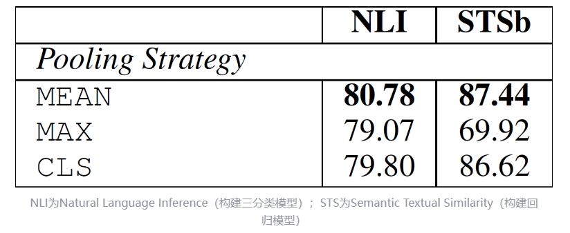

# 八股常见题目
## Lgbm和xgboost区别


## 损失函数？分类分什么不用mse？

## F1指标，AUC？AUC的几何意义？AUC快速计算方式？

## 灾难性遗忘？
1. 数据增强：sft数据混预训练/通用领域数据，continue pretrain混sft数据【数据】
2. Lora【模型】
3. 超参调小，lr小epoch小【配置/训练方式】
4. 先用model做sft数据的ppl计算，去除大的
5. RAG知识库。你以上的想法起始都是基座思想，不是应用思想！所谓的数据模型训练三个角度都是基座，但是以后要考虑应用层面了，例如RAG知识库（缓解幻觉）等等。所以对于一个搜索的岗位，问环节灾难性遗忘应该回答召回增强！这说明你提前没有做好准备。要看人下菜碟，提前准备好这个岗位的人感兴趣的回答，面试官的个人经历如何如何。


## 梯度消失
1. Resnet（模型结构）
2. Clipping
3. 激活函数
4. 层归一化：使得大部分的神经元的输入处于不饱和区域避免梯度消失
5. 参数初始化方法：
   1. 方差缩放：维持输入和输出方差一致。xavier等基于方差缩放的初始化。
      1. 如果输入和输出的方差差距过大，那么会加重梯度消失和爆炸的问题。例如，如果输出的方差变大了，那么其数值的波动范围就变大了，由于dLoss/dW=dloss/dOutput*input.T,则如果input的变化范围更大会导致梯度偏大。（99.7%的数值都在3sigma内）所以可以对方差做限制。然后xavier认为初始化的方差要与该层的神经元个数有关，具体应用了wi和xi独立的假设做方差拆解，且输入和输出方差维持一致。
      2. 但是xavier还要考虑是否有激活函数！激活函数做线性的泰勒展开，线性主部系数倒数平方*原始xavier定的方差为最终方差。Sigmoid y轴 (0.0.5)斜率是0.25，则该激活函数下初始化的参数方差要16倍(因为激活后缩小了1/4，方差缩小1/16，那么参数依照某个分布初始化的这个分布的反差就要在神经元个数的基础上再*16倍)
   2. 范数缩放（正交初始化）。维持输入和输出的范数一致。
      1. 对于第l层神经元和第l+1层神经元之间的参数是一个矩阵，如果这个矩阵是一个正交矩阵，那么恒等激活函数下输入和输出的norm就是不变的。
      2. 具体操作：对于某参数矩阵W(a,a)【正交初始化用于等宽线性网络，因为输入和输入维数不一致则比较范数没有意义】：先做标准正态分布的初始化得到M(a,a)，然后对其做M=UDV.T奇异值分解，UDV都是a*a（classic的奇异值分解的D和M=UDV.T是同shape的）。把U或者V作为W的初始化矩阵。
      3. 对于非线性网络把正交矩阵乘一个缩放系数。
   
## 归一化
1. 归一化为什么可以使得网络训练更加容易：
   1. 更好的尺度不变性：输入和输出的分布更加稳定
   2. 更平滑的优化地形：层归一化可以避免神经元的输入位于不饱和区域；还可以使得优化地形的梯度更加稳定，从而用更大的学习率。
2. 批量归一化：
   1. 在线性（仿射）变化后，激活函数前做。用当前batch的均值和方差估计该批量的mean 和std，然后把每个数据向量的每一维做矩阵axis=0的归一化；但是可能导致归一化后接近0梯度消失，所以引入缩放和平移变换，也就是z score的线性变换az+b。由于zscore要+b所以BN前的线性变换不用bias. 先线性变换、再BN、再平移、再用激活函数激活。（即只针对单个神经元）
   2. 批量归一化不适合RNN Transformer（变长padding）等输入是动态变化的情况
3. 层归一化：
   1. LN是对层的均值和std得到zscore后再做scale和bias
   2. 【大模型中与残差连接有关】FFN中：prenorm容易训练但是效果不好,因为prenorm增加宽度，postnorm增加深度。Prenorm就是x先norm再做FFN变换然后加上残差x；postnorm就是指x先做FFN变换然后加上x，最后走norm
   prenorm就是最先norm，postnorm就是最后norm；prenorm是先norm再transformer再残差连接；postnorm是先transfofmer再残差连接最后norm
4. 权重归一化：将权重再参数分解为长度和方向；缩放权重梯度的长度，矫正梯度的方向。

## 归一化的引申问题：为什么attention机制不去除以q和k的模长？
1. 因为向量的长度大小也是一个重要的信息。我们知道每一个token都有一个向量，那么向量模长大的token其实更加重要。https://www.zhihu.com/question/622562155
2. 或许大家会有一个误区，以为在prenorm或者postnorm下进入attention的token向量x都是归一化了于是内积等价于相似度，其实并不是。因为得到q和k时x要乘wq和wk，此时还是会有长度信息的，不是单位向量。
3. 因此在推荐系统GLU模块下，如果特征刚刚连续化就立刻模长改变了（放大或者缩小），那么attention score当中的内积值(shape是bs,l；l是关注的历史窗口长度)也会受到影响（因为内积结果受到模长影响）；每行的内积值：假设q和k都被gate拉低，那么batch维度每个分量都缩小，整体缩小方差就缩小。
4. 然后再softmax也会受到影响，因为softmax不受分布概率加法的影响但是收到乘法的影响。即softmax后两个类别概率比值是原始logit的差值，则gate使得内积结果扩大后，会导致差值扩大，从而导致概率比值扩大。
## 网络正则化
1. 模型参数复杂性的penalty，但是过度参数化时l1和l2正则效果都不好。
2. 权重衰减：theta_t=(1-beta)*theta_t-1 - lambda *g_t；原始参数变成(1-beta)再更新。
   1. 权重衰减：在标准的sgd下权重衰减等价于l2 正则
   2. 但是在adam下不等价。
   
## dropout
1. 训练时每个神经元的输出以p概率取为output本身，1-p概率取0.也就是以1-p的概率随机把神经元的输出置0.；测试时所有神经元输出都*p。dropout导致网络的输出变成原始的期望的p倍。测试时不可以随机mask因为避免测试的随机性。但是这个问题是输出的分布改变了。所以才有下方的inverted dropout。inverted dropout下测试时什么都不用做
2. 为了方便：inverted dropout
   1. 设保留概率为p，丢弃概率1-p，随机变量\xi 1/0代表每个神经元是否丢弃。
   2. 对神经元h而言，以概率p做1/p的缩放（扩大），以1-p概率清零。则新的神经元h’=({\xi}/p)*h。这样的神经元输出的期望没变。测试阶段不用dropout；【以p的概率扩大，以1-p的概率为0】
   3. 为什么测试不用dropout?确保输出固定，没有随机性；此外输出的norm维持一致。
   4. Dropout为什么可以提升泛化性？引入概率相当于做了bagging，多个模型的合并。

## softmax上下溢？
1. 在极端情况下，输入的logits数值中存在某个分量很大或者很小，例如接近inf或者-inf，那么exp(inf)只会更加大导致上溢；又或者说每个exp(zi)没有超但是求和求起来超了就是上溢。exp(-inf)会非常接近0甚至超出了浮点数所能表示的范围，这就是上下溢。处理方式如下：（以上溢为例）


2. 根据分式性质上下同除一个数，这个数没计算出来，但是可以使得分母求和的值变小就不会溢出了。


3. 取对数，exp(lg(分子)-lg(分母))=分子/分母；但这样分母不会特别大，因为lg(分母)可以用torch.logsumexp();而log(分子)就是zi;做差完毕再exp即可

4. 温度参数，每个logits除以一个【大于1】的温度T则整体logits绝对值变小更接近1
5. 主要避免上溢 因为一般的float32指数位8位，尾数位23位【32 23】

## InfoNCE
https://zhuanlan.zhihu.com/p/506544456
1. 一个对比学校的损失函数，公式如下：$L_q=-log\frac{exp(q·k_+/\tau)}{\sum_{i=0}^k exp(q·k_i/\tau)}$
2. 和交叉熵的关系：$L(\hat{y})=-\sum_{i\in k}y_i log(\hat{y}_i)$ 
   且$\hat{y}_i=\frac{exp(z_i)}{\sum_{i=1}^k exp(z_i)}$
3. 对比学习和cross entropy的区别在于：还是拿CV领域的ImageNet数据集来举例，该数据集一共有128万张图片，我们使用数据增强手段（例如，随机裁剪、随机颜色失真、随机高斯模糊）来产生对比学习正样本对，每张图片就是单独一类，那k就是128万类，而不是1000类了，有多少张图就有多少类。但是softmax操作在如此多类别上进行计算是非常耗时的，再加上有指数运算的操作，当向量的维度是几百万的时候，计算复杂度是相当高的。所以对比学习用上式去计算loss是行不通的。
4. 那怎么办呢？有一种极简化策略就是NCEloss，也就是noise contrastive estimation。这有两个关键概念：
   1. noise constrative就是把一个超高维多分类转变为二分类，把所有非正样本全看成负样本（噪声样本）。当然这还是没有减低softmax复杂度。
   2. estimation就是指对全体负样本做采样，每个批次内1个正样本k-1个负样本。k越大越好
5. 那为什么不用NCE还是要用InfoNCE呢？因为k个数采样降低后，k-1个负样本可能根本不是一个类，强行看成一个父类效果不好。所以InfoNCE认为既然k采样下来了那就在k个里面做k分类交叉熵。所以有了InfoNCE loss。 从这个角度来看，InfoNCE其实就是采样后的in batch 交叉熵。
6. 唯一的区别是，在cross entropy loss里，k指代的是数据集里类别的数量，而在对比学习InfoNCE loss里，这个k指的是负样本的数量。上式分母中的sum是在1个正样本和k个负样本上做的，从0到k，所以共k+1个样本，也就是字典里所有的key。恺明大佬在MoCo里提到，InfoNCE loss其实就是一个cross entropy loss，做的是一个k+1类的分类任务，目的就是想把
这个图片分到$k^+$这个类。
7. 关于温度参数$\tau$的设置：温度系数虽然只是一个超参数，但它的设置是非常讲究的，直接影响了模型的效果。 上式Info NCE loss中的$\tau$相当于是logits，温度系数可以用来控制logits的分布形状。对于既定的logits分布的形状，当$\tau$值变大，则会使得原来logits分布里的数值都变小，且经过指数运算之后，就变得更小了，导致原来的logits分布变得更平滑。相反，如果
$\tau$取得值小，原来的logits分布里的数值就相应的变大，经过指数运算之后，就变得更大，使得这个分布变得更集中，更peak。如果温度系数设的越大，logits分布变得越平滑，那么对比损失会对所有的负样本一视同仁，导致模型学习没有轻重。如果温度系数设的过小，则模型会越关注特别困难的负样本，但其实那些负样本很可能是潜在的正样本，这样会导致模型很难收敛或者泛化能力差。总之，温度系数的作用就是它控制了模型对负样本的区分度。

## Unicode编码
https://www.jianshu.com/p/9c9073e601d7
Unicode是为了解决传统字符编码的局限性而产生的方案，它为每个语言中的字符规定了一个唯一的二进制编码。而Unicode中可能存在一个字符对应多个字节的问题，为了让计算机知道多少字节表示一个字符，面向传输的编码方式的UTF−8和UTF−16也随之诞生逐渐广泛使用。


## 排序算法的时间空间复杂度
https://blog.csdn.net/qq_32793161/article/details/122857725
归并排序是O(n)空间复杂度，快速排序是O(logn)空间复杂度


## 多模态metrics
https://blog.csdn.net/qq_25222361/article/details/78694617#t2
### 生成侧
1. FID用于测量生成模型生成的图片和标准图片之间的距离
$$
\begin{aligned}
   FID=\|μ_r-μ_g\|^2+tr(\Sigma_r+\Sigma_g-2\sqrt{\Sigma_r\Sigma_g})
\end{aligned}
$$
其中$μ_r$和$\Sigma_r$分别是真实images的向量的均值和协方差矩阵
2. ROUGE-N： ngram recall本质是一个召回指标；: The ROUGE metric
is commonly used to evaluate text summarization
and generation. ROUGE-N measures the overlap
of N-grams between the generated and reference
text. The formula for ROUGE-N is
$\begin{aligned}
   ROUGE-N=\frac{\sum_{gram_N \in Ref}Count_{match}(gram_N)}{\sum_{gram_N \in Ref}Count(gram_N)}
\end{aligned}$
3. ROUGE-L:本质是一个f_score（偏向于recall的指标）。计算prediction和ground truth之间的最长公共子序列【非常重要！！！lc1143】的长度占prediction和ground truth各自长度的比例然后求f1 score
   1. 首先求出L=Longest Common Subsequence(pred,gt)
   2. 计算$R_{lcs}=\frac{len(L)}{len(gt)}$;计算$P_{lcs}=\frac{len(L)}{len(pred)}$
   3. 最后计算调和平均数harmonic mean；$ROUGE_L=\frac{(1+\beta^2)R_{lcs}P_{lcs}}{R_{lcs}+\beta^2P_{lcs}}$
   4. 这里的β**2代表着recall 的ratio除以precision 的ratio的比值。实际上beta取得非常大，使得ROUGE-L只与recall有关。因此最终
   $\begin{aligned}
      ROUGE-L=\frac{len(L)}{len(gt)}
   \end{aligned}$
   其实就是最长公共子序列的长度占ground truth长度的比例。总结就是rouge-l倾向于召回
4. BLEU:
   1. 公式 $BLEU(p_n,BP)=BP*exp(\sum_{n=1}^N w_n log p_n)$其中$p_n$是指n_gram下的precision；$w_n$是指对于ngram所赋予的权重
   2. 什么是n_gram下的precision呢？就是pred的所有ngram个数中，处于gt的n_gram中的个数所占的比例。
   3. BP是brevity penalty，
$$BP=
\left\{
 \begin{matrix}
   1&len(pred)>len(gt)\\
   exp(1-\frac{len(pred)}{len(gt)})& len(pred)<=len(gt)
  \end{matrix} 
\right\}
$$
可以看出来len(pred)越小BLEU越大

1. BERTSCORE
   1. https://zhuanlan.zhihu.com/p/658054085；BERT score是token级别的fscore
   2. 用bert模型对pred和gt编码 得到每个token的embedding
   3. 对于pred中的每个token计算其与gt的token中的最大相似度，作为这个token的precision
   4. 对于gt中的每个token计算其与pred中的token的最大相似度作为这个token的recall
   5. 对于pred的所有token的precision计算平均precision P
   6. 对于gt所有token的recall计算平均recall R
   7. （宏平均）计算P和R的调和平均F score;宏平均和微平均的f1score都是公式相同的，区别在于宏平均的macro_p和macro_r是各个类别等权平均，但是minor_p和minor_r是全体TP个数合并等等。
2. CLIPscore：cos similarity between image and text embedding from clip model
### 召回侧
1. MRR mean reciprocal rank: the rank position of the first relevant resutls in the retrieved list.$MRR=\frac{1}{Q}\sum_{q=1}^Q\frac{1}{rank_q}$ Q is the total number of queries.
```
def MRR(preds, truth, cutoffs):
    mrr = [0 for _ in range(len(cutoffs))]
    for pred, t in zip(preds, truth):
        for i, c in enumerate(cutoffs):
            for j, p in enumerate(pred):
                if j < c and p in t:
                    mrr[i] += 1/(j+1)
                    break
    mrr = [k/len(preds) for k in mrr]
    return mrr
```
## 排序损失函数：基于相似性的损失，正例负例等
1. InfoNCE loss
   $L_{InfoNCE}=-log\frac{exp(sim(z_i,z_j))/\tau}{\sum_{k=1}^K exp(sim(z_i,z_k)/\tau)}$
2. Triplet loss
   $L=\sum_{i=1}^Nmax(0,\|f(x_a^i)-f(x_p^i)\|^2-\|f(x_a^i)-f(x_n^i)\|^2+\alpha )$从这个公式可以看出来为了维护loss的非负性，如果anchor data 离正样本和负样本的距离差只需要和预期alpha比。例如正减负是-4，而alpha是3则这对例子不参与优化，因为已经满足要求了。
3. f是network，一般是一个encoder,或者是用于编码的network
## 宏平均微平均


## why decoder only？
1. 原文transformer都是两个序列原文和译文，因此需要用encoder处理原文，decoder处理译文。encoder内部做全见注意力（encoder，当然掩码了padding）decoder内部做因果注意力（decoder），最后两者再做交互注意力（decoder的向量作为query，encoder的向量作为key value）然后用来做next token prediction；但是大模型gpt类是一个序列，prompt和response存在时间上的先后，拼成了一个序列进行训练，和CT很像只不过prompt的loss做了掩码。这样拼起来之后只是一个序列，因此只用一个coder就可以，由于decoder是生成式任务的必须，所以就只用decoder了。
2. Decoder only结构的泛化性能更好，few shot和zero shot泛化性能更好。其中decoder 利于few shot是因为，prompt和shots可以更加直接地作用于模型的每一层参数/论文提出的经验和现象
3. 双向attention注意力矩阵容易退化为低秩矩阵，而causal attention的注意力矩阵是一个下三角矩阵，必须满秩，信息集中。这里展开介绍一下。https://spaces.ac.cn/archives/9529
   1. 在attention is not all you need https://zhuanlan.zhihu.com/p/356956903中，论文介绍了传统的双向self attention（主要是bert albert xlnet）容易出现token的表征矩阵n*hidden的秩坍缩为1，即所有token的向量表征趋近相同的问题。
   2. bert和albert不用说了都是双向attention，xlnet有点特殊，是基于AR模型的建模思路设计的能看得见双向信息的广义AR模型。
   3. 具体而言坍缩也是有条件的，是指：在没有跳跃链接和MLP下，一个多层多头自注意力机制的输出SAN(X)距离一个秩为1的矩阵的距离会随着层数L的增长指数级衰减，底数是输入X离秩为1的矩阵的距离。但是有了跳跃连接和MLP升维再降维就可以避免。
   4. 意思是指随着L层数的增大，一个SAN(x)=(n,dim)=PV（P是一个n*n的softmax V是一个n*dim的矩阵）会退化到秩为1（主要是softmax后的P矩阵)，导致全体n个token的embedding区域一致。V是n*d，而P是n*d和d*n的内积的softmax(n>>d)。而Decoder-only架构的Attention矩阵是一个下三角阵，注意三角阵的行列式等于它对角线元素之积，由于softmax的存在，对角线必然都是正数，所以它的行列式必然是正数，即Decoder-only架构的Attention矩阵一定是满秩的！满秩意味着理论上有更强的表达能力，也就是说，Decoder-only架构的Attention矩阵在理论上具有更强的表达能力，改为双向注意力反而会变得不足。
   5. 线性Attention是n×d的矩阵与d×n的矩阵相乘，秩一定不超过d，标准Attention是n×d的矩阵与d×n的矩阵相乘后加softmax，softmax会有一定的升秩作用，参考《Transformer升级之路：3、从Performer到线性Attention》中的“低秩问题”一节及评论区）
4. 纯粹的decoder only结构做next token prediction每个位置接触的信息比其他结构更少，预测下一个token难度加大，模型足够大时学习通用表征的能力更强
5. Causal attention具有隐式的位置编码功能，打破了transformer的位置不变性；但是双向attention的模型如果不带有位置编码，双向attention的部分token即使对换也不可以改变表示，对语序的区分能力天生较弱。
6. Decoder only的结构可以使用kv cache，对多轮对话更友好。每个token表示只和其之前的输入有关，而encoder decoder 和prefix lm就做不到。包括megatron flash attention等对causal attention支持就更好。在此基础上还延申了scaling law等等。Encoder decoder结构更适合做翻译任务。encoder only适合做retrieval任务。

## ASCII码到unicode
https://www.jianshu.com/p/9c9073e601d7
1. A的ASCII码是65；a的ASCII码是97；大小写差32。但是不是代表所有差32的都是大小写对应关系
2. 为什么要有编码？大家需要明确的是在计算机里所有的数据都是字节的形式存储、处理的。我们需要这些字节来表示计算机里的信息。但是这些字节本身又是没有任何意义的，所以我们需要对这些字节赋予实际的意义。所以才会制定各种编码标准。
3. 编码模型：简单字符集和现代编码模型
   1. 简单字符集：ASCII就是一个例子。在ASCII中，定义了一个字符集包含什么字符，以及如何把字符映射为计算机的比特。例如A->0100 0001（这在二进制下表示65，但是其本质只是一个字节8个位而已。不同进制有不同的意思。）
   2. 现代编码模型：比较复杂，同样为了将字符映射为比特需要经过下面三步。
      1. 【字符表】定义字符表，即系统需要哪些字符。
      2. 【编码字符集】字符表映射到整数。这个映射叫做编码字符集。例子是unicode。这部分还没有涉及到任何进制。
      3. 【字符编码表】把第二步得到的映射到的整数转换为有限长度的比特值，以便于用二进制表示这个整数。这叫做字符编码表。例子是UTF-8 和UTF-16
4. 在计算机中，所有的信息最终都表示为一个二进制的字符串，每一个二进制位有 0 和 1 两种状态，通过不同的排列组合，使用 0 和 1 就可以表示世界上所有的东西。
5. ASCII码：ASCII 码一共定义了 128 个字符，包括英文字母 A-Z，a-z，数字 0-9，一些标点符号和控制符号等。这 128 个字符只使用了 8 位二进制数中的后面 7 位，最前面的一位统一规定为 0。
6. 英语用128个字符来编码是完全够用的，但是其他语言不行.一些欧洲的国家就决定，将 ASCII 码中闲置的最高位利用起来，这样一来就能表示 256 个字符。但是，这里又有了一个问题，那就是不同的国家的字符集可能不同，就算它们都能用 256 个字符表示全，但是同一个码点（也就是 8 位二进制数）表示的字符可能可能不同。例如，144 在阿拉伯人的 ASCII 码中是 گ，而在俄罗斯的 ASCII 码中是 ђ。因此，ASCII 码的问题在于尽管所有人都在 0 - 127 号字符上达成了一致，但对于 128 - 255 号字符上却有很多种不同的解释。与此同时，亚洲语言有更多的字符需要被存储，一个字节已经不够用了。
7. \[GB2312\]中文中:一个小于 127 的字符的意义与原来相同(英语)，但两个大于 127 的字符连在一起时，就表示一个汉字；前面的一个字节（他称之为高字节）从 0xA1 用到 0xF7，后面一个字节（低字节）从 0xA1 到 0xFE；这样我们就可以组合出大约 7000 多个简体汉字了。在这些编码里，我们还把数学符号、罗马希腊的字母、日文的假名们都编进去了，连在 ASCII 里本来就有的数字、标点、字母都统统重新编了两个字节长的编码，这就是常说的 全角字符。(也就是说半角数字标点字母等是ASCII中用一个字节编码出来的,但是中文还有全角字符用两个字节新定义.例如.和"。")而原来在 127 号以下的那些就叫 半角字符 了。
8. \[GBK\]:由于GB2312不够用，于是干脆不再要求低字节一定是 127 号之后的内码，只要第一个字节是大于 127 就固定表示这是一个汉字的开始，不管后面跟的是不是扩展字符集里的内容。结果扩展之后的编码方案被称为 GBK 标准，GBK 包括了 GB2312 的所有内容，同时又增加了近 20000 个新的汉字（包括繁体字）和符号。
9. DBCS:少数民族的字符,Double Byte Charecter Set：双字节字符集。最大的特点是两字节长的汉字字符和一字节长的英文字符并存于同一套编码方案里，因此他们写的程序为了支持中文处理，必须要注意字串里的每一个字节的值，如果这个值是大于 127 的，那么就认为一个双字节字符集里的字符出现了。

10. UNICODE:将全世界所有的字符包含在一个集合里，计算机只要支持这一个字符集，就能显示所有的字符，再也不会有乱码了。
它从 0 开始，为每个符号指定一个编号，这叫做”码点”（code point）。比如，码点 0 的符号就是 null（表示所有二进制位都是 0）。
U+0000 = null
上式中，U+表示紧跟在后面的十六进制数是 Unicode 的码点。这么多符号，Unicode 不是一次性定义的，而是分区定义。每个区可以存放 65536 个（2^16）字符，称为一个平面（plane）。目前，一共有 17 个平面，也就是说，整个 Unicode 字符集的大小现在是 2^21。

最前面的 65536 个字符位，称为基本平面（缩写 BMP），它的码点范围是从 0 一直到 2^16-1，写成 16 进制就是从 U+0000 到 U+FFFF。所有最常见的字符都放在这个平面，这是 Unicode 最先定义和公布的一个平面。

剩下的字符都放在辅助平面（缩写 SMP），码点范围从 U+010000 一直到 U+10FFFF。

Unicode 只规定了每个字符的码点，到底用什么样的字节序表示这个码点，就涉及到编码方法。
11. Unicode编码方案:之前提到，Unicode 没有规定字符对应的二进制码如何存储。以汉字“汉”为例，它的 Unicode 码点是 0x6c49，对应的二进制数是 110110001001001，二进制数有 15 位，这也就说明了它至少需要 2 个字节来表示。可以想象，在 Unicode 字典中往后的字符可能就需要 3 个字节或者 4 个字节，甚至更多字节来表示了。这就导致了一些问题，计算机怎么知道你这个 2 个字节表示的是一个字符，而不是分别表示两个字符呢？这里我们可能会想到，那就取个最大的，假如 Unicode 中最大的字符用 4 字节就可以表示了，那么我们就将所有的字符都用 4 个字节来表示，不够的就往前面补 0。这样确实可以解决编码问题，但是却造成了空间的极大浪费，如果是一个英文文档，那文件大小就大出了 3 倍，这显然是无法接受的。[utf-32]就是全体码点不论几个字节都扩充为4个字节的编码方式,很耗空间.(定长编码,所有字符统一用4个字节)
12. UTF-8编码:UTF-8 是一个非常惊艳的编码方式，漂亮的实现了对 ASCII 码的向后兼容，以保证 Unicode 可以被大众接受。UTF-8 是目前互联网上使用最广泛的一种 Unicode 编码方式，它的最大特点就是可变长。它可以使用 1 - 4 个字节表示一个字符，根据字符的不同变换长度。编码规则如下：

对于单个字节的字符，第一位设为 0，后面的 7 位对应这个字符的 Unicode 码点。因此，对于英文中的 0 - 127 号字符，与 ASCII 码完全相同。这意味着 ASCII 码那个年代的文档用 UTF-8 编码打开完全没有问题。对于需要使用 N 个字节来表示的字符（N > 1），第一个字节的前 N 位都设为 1，第 N + 1 位设为 0，剩余的 N - 1 个字节的前两位都设位 10，剩下的二进制位则使用这个字符的 Unicode 码点来填充。

编码规则如下：

Unicode 十六进制码点范围UTF-8 二进制

0000 0000 - 0000 007F0xxxxxxx

0000 0080 - 0000 07FF110xxxxx 10xxxxxx

0000 0800 - 0000 FFFF1110xxxx 10xxxxxx 10xxxxxx

0001 0000 - 0010 FFFF11110xxx 10xxxxxx 10xxxxxx 10xxxxxx

根据上面编码规则对照表，进行 UTF-8 编码和解码就简单多了。下面以汉字“汉”为利，具体说明如何进行 UTF-8 编码和解码。

“汉”的 Unicode 码点是 0x6c49（110 1100 0100 1001），通过上面的对照表可以发现，0x0000 6c49 位于第三行的范围，那么得出其格式为 1110xxxx 10xxxxxx 10xxxxxx。接着，从“汉”的二进制数最后一位开始，从后向前依次填充对应格式中的 x，多出的 x 用 0 补上。这样，就得到了“汉”的 UTF-8 编码为 11100110 10110001 10001001，转换成十六进制就是 0xE6 0xB7 0x89。

解码的过程也十分简单：如果一个字节的第一位是 0 ，则说明这个字节对应一个字符；如果一个字节的第一位 1，那么连续有多少个 1，就表示该字符占用多少个字节。

13. UTF-16:Windows 内核、Java、Objective-C (Foundation)、JavaScript 中都会将字符的基本单元定为两个字节的数据类型，也就是我们在 C / C++ 中遇到的 wchar_t 类型或 Java 中的 char 类型等等，这些类型占内存两个字节，因为 Unicode 中常用的字符都处于 0x0 - 0xFFFF 的范围之内，因此两个字节几乎可以覆盖大部分的常用字符。UTF-16 编码介于 UTF-32 与 UTF-8 之间，同时结合了定长和变长两种编码方法的特点。它的编码规则很简单：基本平面的字符占用 2 个字节，辅助平面的字符占用 4 个字节。也就是说，UTF-16 的编码长度要么是 2 个字节（U+0000 到 U+FFFF），要么是 4 个字节（U+010000 到 U+10FFFF）。那么问题来了，当我们遇到两个字节时，到底是把这两个字节当作一个字符还是与后面的两个字节一起当作一个字符呢？

这里有一个很巧妙的地方，在基本平面内，从 U+D800 到 U+DFFF 是一个空段，即这些码点不对应任何字符。因此，这个空段可以用来映射辅助平面的字符。因此，当我们遇到两个字节，发现它的码点在 U+D800 到 U+DBFF 之间，就可以断定，紧跟在后面的两个字节的码点，应该在 U+DC00 到 U+DFFF 之间，这四个字节必须放在一起解读。


14. JavaScript 语言出现的时候，还没有 UTF-16 编码,所以用的UCS-2.
JavaScript 字符串允许直接输入字符，以及输入字符的转义形式。举例来说，“中”的 Unicode 码点是 U+4e2d，你可以直接在字符串里面输入这个汉字，也可以输入它的转义形式\u4e2d，两者是等价的。
但是，JavaScript 规定有 5 个字符，不能在字符串里面直接使用，只能使用转义形式。

U+005C：反斜杠（reverse solidus)

U+000D：回车（carriage return）

U+2028：行分隔符（line separator）

U+2029：段分隔符（paragraph separator）

U+000A：换行符（line feed）

举例来说，字符串里面不能直接包含反斜杠，一定要转义写成\或者\u005c。

这个规定本身没有问题，麻烦在于 JSON 格式允许字符串里面直接使用 U+2028（行分隔符）和 U+2029（段分隔符）。这样一来，服务器输出的 JSON 被 JSON.parse 解析，就有可能直接报错。根据标准，JSON 数据必须是 UTF-8 编码. JSON 本来就不允许直接包含正则表达式。
15.  Emoji 表情是四个字节，而 mysql 的 utf-8 编码最多三个字节，所以导致数据插不进去。真正的 utf8 编码(大家都使用的标准)，最大支持 4 个 bytes


## function calling
1. 目前用LLM做file operations都是把整个文件重写的。因此可能会存在极少部分情况下文件内容超过上下文窗口的问题。
2. function calling的全流程：
   1. 用户向应用程序发出提示词（prompt）

   2. 应用程序会传递用户提供的提示词和函数声明（Function Declaration(s)），即对模型所需工具的描述信息

   3. 根据函数声明，模型会给出工具选取建议和相关的请求参数。注意，模型仅会输出建议的工具和请求参数，并不会实际调用函数

   4. 应用程序根据模型响应调用相关 API【这部分调用是本地】

   5. 将 API 的响应内容再次输入模型，生成人类可读的内容

   6. 应用程序将最终响应返回给用户，然后再次回到第 1 步，如此循环往复
3. 函数调用机制的主要步骤：
一、用户输入：用户通过自然语言向模型提出问题或请求。这些问题或请求可能需要调用外部函数来获取答案或执行某些操作。
二、模型解析：模型接收到用户输入后，会解析并理解输入内容。模型会根据其训练数据和算法判断是否需要调用函数，并确定要调用的函数及其参数。
三、生成函数调用：如果模型确定需要调用函数，它会生成一个包含函数调用所需参数的结构化输出。这通常是一个JSON对象，其中包含函数名、参数列表等信息。这个JSON对象是以字符串形式存在的，需要在实际调用函数之前进行解析。
四、函数调用执行：在您的代码中，您需要解析这个字符串化的JSON对象，将其转换为有效的数据结构（如字典或对象），并使用这些参数调用相应的函数。这个过程是在您的代码环境中完成的，而不是在模型内部。模型只是提供了调用函数所需的参数和信息。
五、处理函数结果：函数调用执行完成后，您需要将函数的结果返回给模型。这通常通过将结果附加到模型中再次调用模型来实现。模型会接收并处理这些结果，然后生成一个自然语言回复给用户，总结或解释函数调用的结果。
4. 以你之前做的csv assistant来说，那个项目不完全是function calling，因为你没有事先把一个写好的封装好的函数通过functions的方式传给agent，而是你直接让agent自己写代码生成这个函数。但是肯定两者是可以结合的，也即是可以让agent写好这个函数后自己定义一个命令行语句，把这个命令行语句抽象成一个函数给llm告诉他可以这样运行这个代码。并让他自己决定运行的时机并写带有参数的函数头，然后你在本地运行它返回给你的命令得到结果再把结果给llm让他生成文本结论等等。

## 为什么bert embedding可以相加
1. bert这类encoder模型对于每一个token都会有一个向量表征。为了充分表示这个token的信息，作者设计了三个embedding的相加，即token embedding，position embedding，segment embedding。其中为了获取连续的token embedding，首先需要把n个token每一个token都通过词表得到的索引转换为one hot向量，则n个token转换为（n,vocab_size）的离散矩阵。然后右乘一个(vocab_size,hidden_dim)的dense的projection matrix得到的向量表示。
2. 但是单单有它是不够的。还需要考虑位置信息和句子信息。因为bert这样的bidirectional encoder(self attention )求和具有位置变换不变性，要想纳入位置信息必须额外考虑句子内部的位置编码。于是离散的位置编码方式自然就是；此外，因为BERT的训练任务有NSP，所以有时候可能要一同输入两个句子判断是否是连续的两个句子。那么于是用0或者1区分这两个句子的开始和结束。仿照着token embedding的获取方式也是先用离散向量表示，再通过全连接映射到连续向量embedding。其中位置矩阵就是一个(n,sequence_length)的离散矩阵，而segement矩阵则是一个(n,2)的矩阵。这两个矩阵每行都是一个one hot向量，分别表示token的位置索引以及属于前一句还是后一句。
3. 每个token都有三个onehhot后需要融合信息，由于三个onehotshape不同无法相加所以concat起来按照列方向拼接，得到一个vocab_size+sequence_length+2的3-hots向量。这个向量需要转dense，于是要过一个大的projection matrix,这个matrix就同样是三个matrix行方向的拼接。
4. 而每一个multihot的向量右乘一个dense matrix矩阵，由于只有三个位置是1，所以相当于dense matrix对应位置的向量相加了。其实本质原因还是一个矩阵乘法。

## bert-sbert-dpr-bge_embedding-bge_reranker
https://zhuanlan.zhihu.com/p/22798787107
1. bert当然无需多言 一个单塔 bidirectional self attention encoder【注意biencoder是双编码器是双塔是dual encoder，bidirectional attention才是单塔的双向self attention】
2. sbert：SBERT是一个基于bert的用于句子的嵌入模型，并不与下游任务挂钩；是针对句子表征的BERT，为句子嵌入空间的微调设计了分类任务，结构上是一个双塔dual encoder；Sentence-BERT（SBERT）通过对预训练的BERT进行修改，使用Siamese and Triplet Network（孪生网络和三胞胎网络）生成具有语义的句子的embedding（语义相近的句子的embedding距离就比较近），从而可以使用余弦相似度、曼哈顿距离、欧氏距离等找出语义相似的句子；
   1. 先看下一般的孪生网络及其对比学习损失：对比学习的损失是两种情况二选一，同类则使得距离尽量小，不同类则使得距离要大于m损失是（m-dis）
   2. 再看看三生网络：一次性输入1正2负或者1负两正.三胞胎网络（Triplet Network）：输入有三个，可以是一个正例 + 两个负例，或一个负例 + 两个正例。训练的目标仍然是让相同类别间的距离尽可能小，不同类别间的距离尽可能大。但是只需要考虑2组距离就行了不用3组。假设有3个句子，其中s1和s2语义相近，s1和s3语义相反。将三个句子分别输入三个神经网络（完全一样且共享参数），得到3个输出。我们希望output1和output2的距离尽可能接近，output1和output3距离尽可能远，至于output2和output3的距离，我们可以不用理会。
      这里的anchor可能正可能负
怎么理解该公式？满足max的三元组才是需要优化训练的三元组
如果一个三元组不满足max，也就是a和p之间的距离加上一个m都比a和n之间的距离小，表明对于这个三元组网络的预测效果很好，没必要对这个三元组再进行优化
此时如果不使用max的话，这个三元组产生的loss就是负数了，所以加上max把这个三元组的loss置为0
   1. 接下来我们看下SBERT的主要贡献
      1. Pooling策略：对于每个encoder得到某个句子的表征，实验对比了mean max cls都是mean最好
      2. 损失函数构造 
      3. 回归损失（其实对比学习就是一种特殊的回归损失。把标签为0的两个的内积往0训，把标签为1的两个内积往1训，其实就是同时输入2元组或者3元组多元组构造多项求和损失）
1. dpr：DPR是专门针对retrieval任务的模型，dual encoder分别编码query和passage，也是做了对比学习微调任务的。
   1. DPR也是双塔但是由于针对的是retrieval问题严格区分query encoder和passage encoder。DPR是facebook提出的，工业界也有一个名字embedding base retrieval EBR/dense retrieval/DPR这三个名字可能被混用，他们都是嵌入模型肯定都是做了对比学习训练的。只不过训练时不同塔的功能可能有区别。SBERT没有区分塔的输入角色（虽然也是双塔但是只是分别做sentence a b），但是DPR是有的。只说一个dense retrieval并不知道塔有没有区分，所以可能raptor才严格区分了SBERT和DPR两种embedding model.此外DPR没有分类损失，只有相似度损失。
   2. DPR的架构如下。训练阶段，数据库中有大量的query和document，分别经过一座塔进行encode得到对应的embedding，然后两两做cosine similarity。这个similarity就可以做成loss来反向传播，同时训练两座encode塔。这两个塔往往可以参数共享，称为siamese network，节省一半开销但是效果下降不大。测试阶段，document是存在数据库里的，所以系统只要输入一个query就能很快得到跟所有document的cosine similarity，然后快速得到top-k的结果。然后DPR具体介绍可以看前面，应该是有对比学习的，还有inbatch negative交叉熵
   3. dpr和reranker的不同在于dpr是共享参数然后做了对比学习的损失还是没有query2doc的特征交互，算是一个伪双塔，只是在损失函数上用了对比学习考虑query doc对。但是一般来讲reranker是有cross encoder的。
2. bge embedding主要模块：补充了对比学习的损失函数。双塔biencoder，每个塔是一个bert。两个塔可能是共享参数的（看似退化成了一个塔），因为我们在编码时会用同一个model独立对所有doc并行编码
   1. Transformer 编码器（例如 BERT-base 或 BERT-large）主要用于编码输入文本，并输出 Token 级别的表征。预训练任务通常是 Masked Language Model (MLM) 和对比学习（Contrastive Learning）。
   2. 池化层（Pooling Layer）BGE采用多种池化方式，如 [CLS] Token、平均池化（Mean Pooling）、最大池化（Max Pooling）等。目的是将整个序列的 Token 向量转换为 单个固定维度的向量。
   3. 对比学习（Contrastive Learning）BGE 在训练过程中使用 对比学习，即让相似的文本对彼此靠近，非相似文本远离。
   4. 数据输入：训练数据通常采用三元组格式，并进行数据增强以提高模型的鲁棒性。例如，负例可以通过 随机采样、对比损失优化 或 硬负例挖掘（Hard Negative Mining） 来选择，以提升检索的效果。
      ```
      Query: "最佳编程语言"
      Positive: "Python 是最受欢迎的编程语言之一。"
      Negative: "足球比赛的战术分析。"
      ```
3. bge reranker采用cross encoder https://www.sbert.net/examples/applications/cross-encoder/README.html（或者说sbert的技术路线表明reranker是一个单塔的cross encoder）
   1. 目标:BGE-Reranker 的目标是 对候选检索结果进行精细排序，提升检索的最终精度。它在第一阶段检索（如 BGE）基础上，对 Top-K 结果进行更精确的相关性计算。
   2. 网络结构:BGE-Reranker 采用 Cross-Encoder 结构，而非独立的文本嵌入模型。相较于 Bi-Encoder，Cross-Encoder 需要在推理时计算每个 Query-Document 对，因此计算开销更大，但能够更精细地建模查询与文档之间的交互。Bi-Encoder 训练出来的sentence bert/dpr等适用于大规模检索，Cross-Encoder 则适用于精排阶段，以提升最终排序的质量。
   3. 交叉编码（Cross-Encoder）BGE-Reranker 采用 BERT/RoBERTa 作为 Transformer 编码器，但与 BGE 不同，它不是分别计算查询和文档的向量，而是将 查询和候选文档拼接在一起 作为输入。
   4. 典型的输入格式：[CLS] Query [SEP] Document [SEP] 让 Transformer 直接建模 Query 和 Document 之间的交互。
   5. 打分层（Scoring Layer）BGE-Reranker 的输出是 一个标量分数，而不是固定维度的向量。通常使用 [CLS] Token 的隐藏状态，经过一个全连接层（MLP），映射到 [0, 1] 或一个 相关性分数。
   6. 损失函数：BGE-Reranker 使用 Pairwise Ranking Loss，
   7. 训练数据格式训练数据通常采用配对格式：
         ```
         Query: "最佳编程语言"
         Positive: "Python 是最受欢迎的编程语言之一。" Score: 1.0
         Negative: "足球比赛的战术分析。" Score: 0.1
         ```
   8. inference时对于输入的一对文本输出一个分。模型结构是一个单塔cross encoder。
   9. emebedding model是一个双塔bert encoder（一般共享参数）输入一个文本得到embedding，reranker是一个单塔cross encoder输入一对文本输出一个标量
## reranker
https://github.com/answerdotai/rerankers
reranker的训练和微调https://percent4.github.io/NLP%EF%BC%88%E4%B8%80%E7%99%BE%E9%9B%B6%E4%B8%80%EF%BC%89Embedding%E6%A8%A1%E5%9E%8B%E5%BE%AE%E8%B0%83%E5%AE%9E%E8%B7%B5/  # 这个网址上%EF%BC%88三个%表示一个汉字
1. 为什么需要 Reranker？在大多数检索任务中，初次检索的文档集往往包含了许多相关性较低或不完全匹配的内容。这是因为初步检索模型通常基于词频或简单的向量匹配，难以精准捕捉查询和文档之间的深层次语义关系。因此，即使初始结果能找到一些相关文档，也无法保证这些文档是最优的答案。
2. 其实reranker以及像是blip这种跨模态对齐（文attend to 图）或者跨文本交互（query attn to so many docs），是很适合cross encoder！通过定向attn做特征交互。所以bert要设计到第二个任务NSP，即考虑不同句子之间信息的交互。这在reranker里面比较常见。但是bert还是没有corss attn。bert encoder的核心是单塔，用于某个文本综合内部信息的embedding表征和快速召回，为每个文本用同一个encoder塔做编码不涉及不同文本交互。reranker model的核心是双塔，需要做qeury和docs的信息交互，即cross attention。（当然DPR也有做双塔query doc对比学习学习嵌入but whatever）。
3. Reranker 是任何检索架构的重要组成部分，但它们通常也比管道的其他部分更模糊。最近的一些方法开始探索使用大型语言模型（LLMs）作为重新排序器，这是一个备受关注的研究方向。一些方法利用了非常强大的 LLMs，如 GPT-4，来执行零样本的列表重新排序，而另一些方法则通过在大型模型的输出上微调较小模型，达成了一种知识蒸馏的效果，从而创建了更高效的列表重新排序器，如 RankZephyr。此外，最新的研究还探索了在推理阶段引入模型压缩技术，以便使用像 Gemma2 这样的 LLM 作为重新排序器，大幅降低计算成本的同时保持高性能。Reranker 类有一个公开的方法 rank，它接受一个查询和一组文档，并返回一个 RankedResults 对象，如 Section 2.2 所示，其中包含重新排名的文档。
4. 增加top_k的大小，比如从原来的10个，增加到30个。然后再使用更精确的算法来做rerank，使用一一计算打分的方式，做好排序。比如30次的遍历相似度计算的时间，我们还是可以接受的。
5. 与embedding模型不同，Reranker使用问题和文档作为输入，直接输出相似度而不是embedding。本文通过向Reranker输入查询和段落来获得相关性分数。Reranker是基于交叉熵损失进行优化的，因此相关性得分不受特定范围的限制。bge-reranker-v2-m3适用于中英文双语Rerank场景。
6. 某个example中，topk10然后rerank3，把3个doc输入context；另一种方案是top10把top10全都输入context。正如我们所看到的，具有Rerank功能的retrieval引擎在更短的时间（本文速度提升了约2倍）内生成了准确的输出。虽然两种响应本质上都是正确的，但未经rerank的retrieval引擎包含了大量不相关的信息，从而影响了查询和推理的速度 - 我们可以将这种现象归因于“上下文窗口无效数据的污染”。（不rerank下context多且错，干扰llm。）
7. 这也是RAG和传统搜索的不同点。传统搜索是把内容推荐给用户，那么从用户的点击和转化出发会考虑多样性、商品之间的相关性、在手机界面的位置分布等。但是RAG是面向llm的搜索，需要考虑context和query的逻辑关联、上下文长度、思维链等。
8. reranker的结构请见上一点
9. bge的reranker主页 https://bge-model.com/tutorial/5_Reranking/5.1.html
## llama创新
 LLAMA
Pre-Normalization（Pre-Norm，层前归一化）

RMSNorm（Root Mean Square Layer Normalization，均方根层归一化）：

旋转位置编码（RoPE）

稀疏注意力（Sparse Attention）

SwiGLU激活函数：

grouped-query attention (GQA)

长上下文

## 激活函数篇
20250508 腾讯二面  llama三大项 rope swishglu rmsnrom pre

                        
原文链接：https://blog.csdn.net/yuleicqut/article/details/145865429
1. SwiGLU?GLU?swish？GELU？
https://zhuanlan.zhihu.com/p/650237644
   1. relu FFN： 线性变换的relu再做线性变换。即升维再降维。升维的线性变换做element wise的relu然后再做降维的线性变换。$FFN_{relu}(x,W_1,W_2,b_1,b_2)=Relu(xW_1+b_1)W_2+b_2$
   2. GELU：平滑后的relu,处处可微非线性。
   3. GLU:线性变换的sigmod 叉乘 线性变换 $GLU(x,W,V,b,c)=\sigma(xW+b)\otimes(xV+c)$。 因为sigmoid齐到一个门控的方法所以要叉乘
   4. swish函数：swish(x)=x*sigmoid(betax)  swish本质带有门控的作用.swish和GLU本质上没太大差别
   5. FFN swish：线性变换的swish右乘线性变换 $FFN_{swish}(x,W_1,W_2)=Swish(xW_1)W_2$
   6. SwiGlu： 线性变换的swish 叉乘 线性变换。正常的GLU里面sigmoid改成swish；正常的GLU的sigmoid输入也是x；
$$SwiGLU(x,W,V,b,c)=swish(xW+b)\otimes(xV+c)$$
## Layernorm和batchnorm和RMSnorm和prenorm和postnorm？

1. 这五种都是归一化方法。首先为什么要归一化？Normalization 的作用很明显，把数据拉回稳定的分布，因为神经网络的Block大部分都是矩阵运算，一个向量经过矩阵运算后值会越来越大，为了网络输出的激活值的稳定性，我们需要及时把值拉回均值为0标准差为1的分布。避免内部协变量偏移。具体而言会先zscore变换再做带有bias的线性变换，即az+b的变换。
2. batchnorm：简单的对于n,d的矩阵，做axis=0的坍缩计算均值标准差，得到d维的均值标准差向量，然后做n次归一化。对于batch输入的每个张量（batch,H,W,C）图片是每个channel独立做的。也就是先reshape成（c,batch,h*w）然后计算对于每一个channel计算得到(c,1,h*w)的均值张量和标准差张量，用来做归一化。每个对应位置的元素减去均值除以标准差做归一化。其中计算均值和标准差的总体是batch个张量相同位置的元素。
3. layernorm：简单的对于n,d的矩阵，做axis=1的坍缩计算均值标准差，得到n维的均值标准差向量，然后做d次归一化。在NLP领域，对于batch输入的每个张量 shape是batch,seq_length,emb_dim，做axis=-1也就是最后一维的归一化。先reshape成batch*seq_length,emb_dim，然后得到（batch*seq_length，1）维的均值和标准差向量，然后做emb_dim次归一化。再reshape回来。
   
```
# features: (bsz, max_len, hidden_dim)
# 
class LayerNorm(nn.Module):
    def __init__(self, features, eps=1e-6):
	super(LayerNorm, self).__init__()
	self.a_2 = nn.Parameter(torch.ones(features))
	self.b_2 = nn.Parameter(torch.zeros(features))
	self.eps = eps
	
    def forward(self, x):
	# 就是在统计每个样本所有维度的值，求均值和方差，所以就是在hidden dim上操作
	# 相当于变成[bsz*max_len, hidden_dim], 然后再转回来, 保持是三维
	mean = x.mean(-1, keepdim=True) # mean: [bsz, max_len, 1]
	std = x.std(-1, keepdim=True) # std: [bsz, max_len, 1]
        # 注意这里也在最后一个维度发生了广播
	return self.a_2 * (x - mean) / (std + self.eps) + self.b_2
```

1. 为什么BN适合CV而Layernorm适合NLP？BN需要对特征做全体batch个样本的标准化，这不适合NLP。因为nlp中输入的句子有的很短有的很长，为了seq_length保持一致往往会做padding填充向量补齐。这些padding不应该影响同句子别的token embedding，所以在做attention时会mask掉（甚至bert 的self或者cross都会）。做BN时就难免把这些padding token的向量纳入均值和标准差计算，这是不对的。LN会对一张图片某一个channel的h*w个像素点做归一化，这也是不对的。因为一张图片中的像素点代表着对应的颜色，要是归一化后这张图片的内部信息发生了融合图片就变样了。
2. RMSnorm LLama三大项之一，是prenorm：对于Layer norm而言为了避免计算均值和标准差减少计算量，可以采用下方的公式
   $$RMS(x)=\sqrt{\sum_{i=1}^n x_i^2}$$ 
   $$\hat{x}=\frac{x}{RMS(x)}$$
   $$RMSNorm(x)=\gamma\odot\hat{x}+\beta$$

1. 目前大模型中基本都采用PostNorm作为归一化层，关于PreNorm和PostNorm之间的对比已经是老生常谈的话题了。Google在tensor2tensor中用了PreNorm，而在bert源码中采用的是PostNorm。大部分大模型采用了PostNorm例如GPT、GLM、T5等，而热门的llama却用了PreNorm。先说结论：PreNorm通常更容易训练，但是效果不如PostNorm解释这个现象，可以从三个角度分析：
   $$prenorm(x_t)=x_t+F_t(norm(x_t))$$
   $$postnorm(x_t)=norm(x_t+F_t(x_t))$$
   1. 模型深度：PreNorm多层叠加增加的是宽度，而PostNorm是增加网络深度，在神经网络中深度通常比宽度更重要。PreNorm是典型的全局残差链接，而PostNorm由于LayerNorm改变了这种残差连接，使得在相同层数情况下，实际深度高于PreNorm，所以效果更好。PreNorm扩充了宽大，相对更好训练。
   2. 梯度传播：这里就不推导公式了，PostNorm中当前层参数梯度的Norm随着参数所在层指数衰减，PreNorm中，当前层参数梯度的Norm几乎不随参数所在层的变化而变化。PreNorm的残差连接效应强，使得梯度的回传更容易，而PostNorm的应用会使得梯度快速衰减，导致模型难以学习。
   3. 训练策略：PostNorm模型通常需要使用学习率预热（Warmup）策略来避免训练初期的不稳定。预热策略在训练开始阶段将学习率从0逐渐增加到设定值，而不是一开始就使用大的学习率。这有助于抑制后面层的学习速度，给前面层更多的优化时间，促进每层的同步优化。而PreNorm由于其结构特点，通常不需要预热策略。【预热也就是学习率从小到大增长，因为前期梯度会比较大，需要小的学习率来抑制模型大幅变动到不准确的位置。】
2. 总的来说PreNorm在训练稳定性和收敛速度上有优势，但PostNorm在模型的深度表达能力和最终效果上通常更胜一筹，因此在大型模型中更常被采用

## 交叉熵和KL散度？

1. KL散度：衡量两个分布之间的差异。
$$\begin{equation*}
D_{KL}(P\|Q)=\sum P(x)log\frac{P(x)}{Q(x)}
\end{equation*}$$
表示用分布Q近似真实分布P时的信息损失。头上的是真实分布，底下的是近似分布，如sft model
1. 交叉熵：用分布Q来编码来自分布P的数据时所需的平均信息量。
$$\begin{equation*}
   H(P,Q)=-\sum P(x)logQ(x)
\end{equation*}$$
1. 熵：真实分布P的熵，用自身编码平均信息量
$$\begin{equation*}
   H(P)=-\sum P(x)log(P(x))
\end{equation*}$$
1. 关系 H(P,Q)=H(P)+D_{KL}(P||Q) 交叉熵就是KL散度加上真实分布的熵。当我们在做训练优化模型参数时，本质是在用模型的输出分布近似数据的真实分布。因此数据的分布是P，模型的输出分布是Q。而分布的差距应当用KL散度刻画。只不过第二项数据分布P的熵在特定情况下可能随着模型参数改变，在分类问题下并没有随着模型参数的改变而改变而是独立的。
2. 优化等价的讨论
   1. 在机器学习中如分类问题或者GAN中的discriminator做二分类，真实分布P来自于数据，数据是离线且固定的，如分类中的标签。所以H(P)是常数和模型需要优化的参数没有关系，真实数据的分布P的熵固定为常数，求梯度为0，交叉熵作为损失函数下的梯度方向等价于KL散度损失函数。最小化交叉熵等价于最小化KL散度。
   2. 在生成模型或者强化学习中，P如果是模型一部分或者需要变化时，必须采用KL散度。因为P分布与被优化的参数有关，所以不能省略熵这一项，例如在PPO这个onLine rl中，需要随着模型参数的改变在线做response的采样，因此P的分布在变化（Q固定为sft model）。不能省略。或者VAE，真实分布P是隐变量的后验分布。PQ同时优化则H(P)也不固定。

## RL专题
https://zhuanlan.zhihu.com/p/692991235
critic是token粒度的，提供是价值函数的预估
rm得到的是sentence粒度的reward(分为orm和prm)
actor就是model的概念
1. RM:
   1. 损失函数
   $$\begin{equation*}
      L_{R}(r_{\phi,D})=-\mathcal{E}_{(x,y_w,y_l)\sim D}log[\sigma (r_{\phi}(y_w|x)-r_{\phi}(y_l|x))]
   \end{equation*}$$
   2. 一般reward会从SFT模型出发通过一个线性层输出一个标量。所以critic和actor同大小.为了使得reward function方差小，会做normalize使得
   $$\begin{equation*}
      E_{(x,y\sim D)}[r_{\phi}(x,y)]=0
   \end{equation*}$$
   3. 理解为
   $$\begin{equation*}
      P(y_w>y_l)=\sigma((r_{\phi}(y_w|x)-r_{\phi}(y_l|x)))=\frac{\exp(r_{\phi}(y_w|x))}{\exp(r_{\phi}(y_w|x))+\exp(r_{\phi}(y_l|x))}
   \end{equation*}$$
   例如r1的reward是1.33,r2是=-0.02,代表对于给定prompt下r1和r2做二分类选优时，logits输出是(1.33,-0.02)。softmax后的概率假设是(0.9,0.1)即认为r1比r2好的概率是0.9，反之为0.1.必须要相同prompt下！才单调可比。
2. PPO
   1. 损失函数
   $$\begin{equation*}
      max_{\pi_{\theta}}\mathcal{E}_{x\sim D,y\sim \pi_{\theta}(y|x)}[r_{\phi}(x,y)-\beta D_{KL}(\pi_{\theta}(y|x)\|\pi_{ref}(y|x))]
   \end{equation*}$$
   一定要注意KL(P|Q)是P*log(P/Q) P这里是policy在变化的。

   2. 可以看出来是一个在线采样。加上KL散度是因为
      1. 避免模型偏移过大到一个rm不准确的分布上
      2. 维护生成的多样性
      3. 避免reward hacking
      4. 由于y在线采样不连续所以这个目标函数不可导。（y是argmax来的或者beam search来的）.
      5. 引申：如何克服argmax的不可导？argmax是对logits向量取最大的index的操作。
         1. softmax与softargmax替代。硬决策转换为软决策
         2. argmax的操作视作强化学习的决策过程，将正确率视作奖励函数。RL
         3. gumble-softmax.在不丢失梯度信息下对于分布采样。适用于离散空间种的优化场景如VAE
3. DPO
   1. 损失函数
$$\begin{equation*}
-\mathcal{E}_{(x,y_w,y_l)\sim D}[log\sigma [\beta [log\pi_{\theta}(y_w|x)-log\pi_{\theta}(y_l|x)-(log\pi_{ref}(y_w|x)-log\pi_{ref}(y_l|x))]]]
\end{equation*}$$

   1. 本质上就是在用离线对比学习拉大policy之下winning response和losing response之间的差距，减了一个ref下的baseline而已
   2. 最大化两个差值的差。损失都是tokenwise计算的只计算response部分。第一个差值是policy上prompt作为conditional下winning response对应的真实label的log概率减去losing response的label 的log概率；第二个差值是reference model上prompt作为conditional下winning response的真实label对应的log概率减去losing response对应的log概率。
   3. DPO的缺点：（1）人标注（2）离线容易过拟合（3）只能给出两个之间的preference但是给不出winning和losing之间的差距，因此虽然好训但是效果不好，不是真正意义上的RLHF。winning的概率和losing的概率可能同时下降
1. GRPO【GRPO：critic估计价值函数替换成平均reward作为baseline这里的reward是根据代码和gt可计算的】critic参数其实要和actor同等大小的网络，甚至output reward下不适合训练很精细的价值函数
   1. 不学习一个critic
   2. 而是对同一道题目、同一个状态，先用旧策略采样多条输出，然后把这些输出的平均 Reward 当作 baseline；
   3. 超过平均值则是正向advantage
   4. 保留了PPO中的clip和reference model的KL。GRPO的目标函数就是：
   $$\begin{equation*}
    J_{GRPO}(\theta)=\mathcal{E}[\sum_{i=1}^G(min(\frac{\pi_{\theta}(o_i)}{\pi_{\theta_{old}}(o_i)}A_i,clip(\frac{\pi_{\theta}(o_i)}{\pi_{\theta_{old}}(o_i)},1-\epsilon,1+\epsilon)A_i)-\beta\mathcal{D}_{KL}(\pi_{\theta}\|\pi_{ref}))]
   \end{equation*}$$
   其中
   $$\begin{equation*}
    A_i=\frac{r_i-mean({r_1,r_2,...,r_G})}{std({r_1,r_2,...,r_G})}
   \end{equation*}$$
   也就是用同一个问题的多条输出做平均得到相对评分，再做标准化后作为 Advantage。这便实现了无需单独价值函数也能得到一个动态的“分数线”，让训练更加简单、节约算力。最后所有输出的相对评分clip后相加作为新的最大化目标函数再减去kl散度

## 送入softmax的logtis如果做了线性变换则输出分布会改变吗？
1. 如果(a,b)乘k倍，会
2. 如果(a,b)每个人+c那么就不会。因为softmax关注的是不同分布之间的差。
3. 连续做两次softmax,第二次的分布输出更接近均匀分布。


## moe?腾讯PCG qq 20250304一面
1. moe是针对LLM什么位置的改进？传统transformer模型的dense FFN计算量很大，所有神经元都要参与计算。为了改进这一点，naive的moe能够根据当天要生成的token动态调整给不同的专家，一个专家就是一个尺寸更小的FFN。对于每个token走完transformer层后，只会走少数的更小参数的专家进行分类输出，减少计算量。这就是稀疏MOE层。
2. 那么如何决定要走哪些专家？会通过一个router分类模块输出一个expert个数的分布向量，代表当前token走各个专家的概率。例如已经有了x1,x2,xn（刚生成完毕），xn的表征走完transformer后得到的表征可能走第i个专家的FFN得到分类向量输出某个token x_{n+1}，然后x_{n+1}又会走第j个专家做分类得到下一个token x_{n+2}。router也是被训练出来的，无需标注像多头一样自己学出来合理的分布（例如adjacent matrix也可以这么考虑）
3. 需要注意的是，计算原理上是不同的token走不同的专家。没有明显的分垂类。也就是说不是每个句子走一个专家，而是不同的token细粒度走不同的专家。不是domain划分的。句子整个走不同的专家不利于负载均衡。token级别的moe减少了每个token需要经过计算的参数减少了计算量。例如deepseek参数量671B，计算token只需激活37B。但是可能最终效果上实现了不同专家聚焦不同领域的任务，在特定的领域表现出色。在处理通用知识领域时，专家分工的效果比不上FFN。毕竟每个专家并没有见到全体的token。此外稀疏激活机制下MOE微调不如dense直接有效。
4. deepseek在此基础上实现了moe改进
   1. 细粒度专家分割。原始的N个专家每个专家FFN的维度缩小到1/m，即每个专家分割成m个更小的专家。那么总共有mN个细粒度专家。为了保持计算成本不变，激活的专家数量增加到原来的m倍。细粒度分割后使得不同的知识更精确地分解到不同细化的专家内部学习。此外选择激活m倍的专家个数后不同专家的输出向量还会做element wise 加法做交融。
   2. 共享专家隔离。在传统路由策略下，不同专家会学习相同的通用知识导致参数冗余。于是用共享专家捕捉整合上下文的通用知识，使得不同的路由专家学习独特知识。具体是从众多专家中隔离出n个专家作为共享专家，无论路由模块如何分配，每个token都会被分配到共享专家做计算，解决传统MOE的通用能力不足的问题。
   3. 解决MOE负载均衡的问题。序列如果有10个token则可能5个token都会路由到同一个专家。这导致了专家分配重叠，其他专家无法充分训练。此外专家分配到不同的设备下负载不均衡会导致计算资源利用不均衡。于是ds：
      1. 专家平衡损失：通过控制专家被选中的频率和平均样本数用超参数约束专家负载平衡避免路由崩溃。
      2. 设备平衡损失：将路由专家分组部署在单个设备，依据设备上专家被平均被选中频率和平均样本数通过超参数控制设备间负载平衡防止计算瓶颈
      3. 无辅助损失策略：该策略通过为每个专家引入个可动态调整的偏差项，将其添加到选择专家分数中来确定topk路由。在训练过程中，根据专家的负载情况动态调整偏差项：如果专家负载过高则减小偏差项；负载不足则增加偏差项。通过互补的序列级辅助损失来防止单个序列内极端不平衡。
      4. 增加节点限制路由机制：使得每个token最多路由到M个节点减少跨节点通信量，结合无token丢弃策略，在训练和推理阶段保持负载均衡。确保数据完整性和性能稳定。
## peft
https://blog.csdn.net/2201_75499313/article/details/136009585
1. adapter和adjacent matrix：adapter是FFN后插入新的模块，会带来额外的推理延迟，adjancet matrix就是lora。
   1. lora其实针对的是self attention的Q K V O矩阵上
   
   2. adapter是一个先升维再降维的bottleneck结构
   3. 区别
      1. 插入位置。LoRA"并联"在Transformer的Q,K,V,O矩阵上，而Adapter是插入在Feed-forward Layer后面。
      2. 推理延迟。LoRA在训练完后其参数可以与原有预训练模型直接合并，变回单分支结构，不会引入额外的延迟；而Adapter由于引入了额外的串联网络层，因此会带来额外的延迟。
      3. 参数存储。使用LoRA进行微调，在训练完毕后只需要保存LoRA本身的参数；而使用Adapter则要保存整个原有模型的参数。
2. lora矩阵的初始化方式？为什么矩阵B被初始化为0，而矩阵A正常高斯初始化。这里讨论另外两种设置的缺点：
   1. 如果B，A全都初始化为0，那么缺点与深度网络全0初始化一样，很容易导致梯度消失(因为此时初始所有神经元的功能都是等价的)。
   2. 如果B，A全部高斯初始化，那么在网络训练刚开始就会有概率为得到一个过大的偏移值Δ W \Delta WΔW从而引入太多噪声，导致难以收敛。
   3. 因此，一部分初始为0，一部分正常初始化是为了在训练开始时维持网络的原有输出(初始偏移为0)，但同时也保证在真正开始学习后能够更好的收敛。
3. prompt tuning prefix tuning？ p-tuning

   1. prefix tuning
      1. Prefix-Tuning 在模型输入前添加一个连续的且任务特定的向量序列（continuous task-specific vectors），称之为前缀（prefix）。前缀被视为一系列“虚拟 tokens”，但是它由不对应于真实 tokens 的自由参数组成。与更新所有 PLM 参数的全量微调不同，Prefix-Tuning 固定 PLM 的所有参数，只更新优化特定任务的 prefix。因此，在生产部署时，只需要存储一个大型 PLM 的副本和一个学习到的特定任务的 prefix，每个下游任务只产生非常小的额外的计算和存储开销。
   2. P-Tuning 的方法思路与 Prefix-Tuning 很相近，P-Tuning 利用少量连续的 embedding 参数作为 prompt 使 GPT 更好的应用于 NLU 任务，而 Prefix-Tuning 是针对 NLG 任务设计，同时，P-Tuning 只在 embedding 层增加参数，而 Prefix-Tuning 在每一层都添加可训练参数。
   3. Prompt Tuning 方式可以看做是 Prefix Tuning 的简化，固定整个预训练模型参数，只允许将每个下游任务的额外个可更新的 tokens 前置到输入文本中，也没有使用额外的编码层或任务特定的输出层。如下图所示，在模型大小增加到一定规模时，仅仅使用 Prompt Tuning 就足以达到 Fine Tuning 的性能。

## 模型压缩
https://blog.csdn.net/qq_51175703/article/details/138320834
蒸馏剪枝量化
## 字节
1. 1个字节8个位，1个Byte8个bit
2. 1个KB的B是字节
3. 1个KB=1024B=2**10B
4. 1GB=2**30B  这里的B是字节。
5. 32B模型的B是十亿是10**9个参数
6. 分页是把整个虚拟和物理内存空间切成一段段固定尺寸的大小。即划分逻辑地址空间至固定大小的页（Page），划分物理内存空间至固定大小的帧（Frame），并建立方案，转换逻辑地址为物理地址（pages to frames）。在 Linux 下，每一页的大小通常为 4KB。页是连续的虚拟内存，帧是非连续的物理内存，不是所有的页都有对应的帧。https://blog.csdn.net/gatieme/article/details/52384636

## deepseek 篇
### deepseek r1
1. 在开发 DeepSeek-R1 过程中，DeepSeek 尝试了过程奖励模型（PRM）和蒙特卡罗树搜索（MCTS），但均未成功。
   1. 过程奖励模型难以明确定义细粒度推理步骤，判断中间步骤正确性困难，自动标注效果差且手动标注难以扩展，还容易出现奖励作弊，增加训练成本，限制了其在大规模强化学习中的应用。
   2. 蒙特卡罗树搜索用于提升测试时计算可扩展性时，因大语言模型的 token 生成搜索空间远大于棋类游戏，虽设置最大扩展限制仍易陷入局部最优，且模型训练困难，影响生成质量，导致模型难以迭代改进。
2. r1 zero的结论
   1. 纯RL不适合小模型。小模型适合蒸馏SFT：将更强大的模型蒸馏到较小模型上能产生出色的效果，而依赖本文所述大规模强化学习的较小模型，不仅需要巨大的计算能力，甚至可能无法达到蒸馏所实现的性能。
   2. 虽然蒸馏策略既经济又有效，但要突破智能的边界，可能仍需要更强大的基础模型和更大规模的强化学习。
3. （先有r1 zero再有r1）DeepSeek-R1 使用冷启动数据的主要目的是为了解决 DeepSeek-R1-Zero 在训练早期出现的训练不稳定问题。相比于直接在基础模型上进行 RL，使用少量的 SFT 数据进行冷启动，可以让模型更快地进入稳定训练阶段：
   1. 可读性：冷启动数据使用更易于理解的格式，输出内容更适合人类阅读，避免了 DeepSeek-R1-Zero 输出的语言混合、格式混乱等问题。
   2. 潜在性能：通过精心设计冷启动数据的模式，可以引导模型产生更好的推理能力。
   3. 稳定训练：使用 SFT 数据作为起始点，可以避免 RL 训练早期阶段的不稳定问题。
   4. 大模型在RL阶段可能出现许多高阶推理模式。而小模型因为容量和表示能力有限，很难在无监督或纯RL情境下学到相似水平的推理模式。
   5. 蒸馏可将「大模型的推理轨迹」直接转移给小模型，小模型只需要模仿大模型相对完备的推理流程，可以在较小训练/推理开销下取得远胜于自身独立强化学习的效果。
4. 这里主要通过「结果判定」的方式：对于数学题、编程题等有客观正确答案的任务，可以把最终答案与标准结果对比给出奖励。虽没有逐步的过程标注，但最终答案正确与否足以在RL中当作回报（Reward）来引导模型学会更好的推理。
部分中间也会酌情使用格式奖励，用来约束模型输出思考过程，这是一种「作弊少、易维护」的思路。

### MLA 
https://zhuanlan.zhihu.com/p/16730036197   深度好文！
https://spaces.ac.cn/archives/10091
https://deepseek.csdn.net/67b9ce0a3c9cd21f4cba63bf.html
https://zhuanlan.zhihu.com/p/15153745590
1. 在传统的Transformer架构中，多头注意力（MHA）机制允许模型同时关注输入的不同部分，每个注意力头都独立地学习输入序列中的不同特征。然而，随着序列长度的增长，键值（Key-Value，KV）缓存的大小也会线性增加，这给模型带来了显著的内存负担。
2. 为解决MHA在高计算成本和KV缓存方面的局限性，DeepSeek引入了多头潜在注意力（MLA）。多头潜在注意力（MLA）采用低秩联合压缩键值技术，优化了键值（KV）矩阵，显著减少了内存消耗并提高了推理效率。
   1. 低秩联合压缩键值：MLA通过低秩联合压缩键值（Key-Value），将它们压缩为一个潜在向量（latent vector），从而大幅减少所需的缓存容量。这种方法不仅减少了缓存的数据量，还降低了计算复杂度。
   2. 优化键值缓存：在推理阶段，MHA需要缓存独立的键（Key）和值（Value）矩阵，这会增加内存和计算开销。而MLA通过低秩矩阵分解技术，显著减小了存储的KV（Key-Value）的维度，从而降低了内存占用。
3. 主要步骤
   1. 输入映射到潜在空间: 
   $$Z=f(X)\in R^{n \times k},X\in R^{n \times d},k<<d$$ 
   f是全连接层等

   2. 对Z做正常的MHA（h个头）然后用W_o输出。Z和输出MHA(Z)都是n*K
   3. 映射回原始空间 
   $$Y=g(MultiHead(Z))\in R^{n \times d}$$ 
   g为非线性变换 如全连接
4. 图示  
5. 代码
   ```
   import torch
   import torch.nn as nn

   class MultiHeadLatentAttention(nn.Module):
      def __init__(self, input_dim, latent_dim, num_heads):
         super(MultiHeadLatentAttention, self).__init__()
         self.latent_proj = nn.Linear(input_dim, latent_dim)  # 映射到潜在空间
         self.attention = nn.MultiheadAttention(embed_dim=latent_dim, num_heads=num_heads)
         self.output_proj = nn.Linear(latent_dim, input_dim)  # 映射回原始空间

      def forward(self, x):
         # 输入映射到潜在空间
         latent = self.latent_proj(x)
         # 在潜在空间中计算多头注意力
         attn_output, _ = self.attention(latent, latent, latent)
         # 映射回原始空间
         output = self.output_proj(attn_output)
         # 然后再做FFN 升维再降维 再 softmax得到下一个token
         return output
   batch_size, seq_len, input_dim = 32, 128, 512
   x = torch.rand(batch_size, seq_len, input_dim)
   mla = MultiHeadLatentAttention(input_dim=512, latent_dim=128, num_heads=8)
   output = mla(x)
   ```
6. 节省KVcache的常规方法
   1. 共享KV：多个Head共享使用1组KV，将原来每个Head一个KV，变成1组Head一个KV，来压缩KV的存储。代表方法：GQA，MQA等；GQA是不同head共享KV
   2. 窗口KV：针对长序列控制一个计算KV的窗口，KV cache只保存窗口内的结果（窗口长度远小于序列长度），超出窗口的KV会被丢弃，通过这种方法能减少KV的存储，当然也会损失一定的长文推理效果。代表方法：Longformer等
   3. 量化压缩：基于量化的方法，通过更低的Bit位来保存KV，将单KV结果进一步压缩，代表方法：INT8等
   4. 计算优化：通过优化计算过程，减少访存换入换出的次数，让更多计算在片上存储SRAM进行，以提升推理性能，代表方法：flashAttention等
7. MLA 伪代码里面矩阵乘法应该换位置but whatever在每个transformer层里，只缓存了蓝框的向量$c_t^{KV}$和$k_t^{R}$
   1. 第一步处理KV：对于输入$h_t$做低秩压缩，将d维的输入经过$W^{DKV}$变换后压缩成$d_c$维的$c_t{KV}$V3中d=7168，$d_C$为512=4*$d_h$ 
   $$c_t^{KV}=W^{DKV}h_t$$
   $$
      [k_{t,1}^C;k_{t,2}^C;...;k_{t,n_h}^C]=k_t^C=W^{UK}c_t^{KV}$$
      $$
      [v_{t,1}^C;v_{t,2}^C;...;v_{t,n_h}^C]=v_t^C=W^{UV}c_t^{KV}
   $$
   其实也即是$W^{UK}W^{DKV}$和$W^{UV}W^{DKV}$两个低秩矩阵的乘积替代了原始MHA的一个大的d*d的矩阵。此时每个头都有一个k v，和MHA的kv数量还是一致的。类似Lora一样先压缩再扩展减少大MLP的参数量
   2. 处理Q：类似的方法，$$c_t^Q=W^{DQ}h_t$$
   $$
   [q_{t,1}^C;q_{t,2}^C;...;q_{t,n_h}^C]=q_t^C=W^{UQ}c_t^Q
   $$
   也就是用$$W^{UQ}*W^{DQ}$$近似原始MHA的$W_q$这里得到的qkv其实还都是隐层！仍旧是隐层分配给不同的头，所谓的降维只是矩阵的分解存在降维
   3. qk增加ROPE位置编码。注意到这里增加rope是新创造了$q_t^R$和$k_t^R$来做的
   $$
   [q_{t,1}^R;q_{t,2}^R;...;q_{t,n_h}^R]=q_t^R=ROPE(W^{QR}c_t{Q})
   $$
   $$
   k_t^R=ROPE(W^{KR}h_t)
   $$
   两个额外的细节：
      1. $q_t^R$ $k_t^R$的维度是很小的维度，ds设置为$d_h/2$
      2. 这里计算的$k_t^R$其实是MQA的方式，同一层中所有的head共享一个$k$；但是每个$q^R$在不同head是不同的
   接着就对q和t做扩充拼接(i代表head索引)
   $$q_{t,i}=[q_{t,i}^C;q_{t,i}^R]$$
   $$k_{t,i}=[k_{t,i}^C;k_{t}^R]$$
   其中C上标代表着通过低秩压缩得到的q,k向量，后面补充的是ROPE的q^R,k^R向量，且K共享一份。
   
   4. 为什么要这么做？因为：位置编码使用RoPE，但RoPE与低秩KV不兼容。具体来说，RoPE对Q和K都是位置敏感的。如果我们为 
$k_t^{C}$应用RoPE，那么公式（42）的 $W^{U,K}$（K的权重矩阵）将与位置敏感的RoPE矩阵耦合。因此，在推理过程中，$W^{U,K}$ 无法再被吸收到 $W^{U,Q}$（Q的权重矩阵）中，因为与当前生成的token相关的RoPE矩阵将位于$W^{U,Q}$ 和 $W^{U,K}$之间，而矩阵乘法不满足交换律。因此，我们必须在推理过程中重新计算所有前缀token的k，这将极大地降低推理效率。
      1. 为了理解这个，我们介绍下矩阵吸收运算。矩阵吸收运算就是指对于$x'_1=Px_1$,$x'_2=Qx_2$要计算$${x'}^T_{1}{x'}_2=x_1^T P^T Q x_2$$可以采取矩阵的结合律运算,x_1不动先把P.TQ计算出来。而不是两个人分别计算了得到x1'和x2'，因为x1'或者x2'可能是高维的（即矩阵Q可能会升维）如果先计算乘法就可以保持x1和x2的低维特性节省内存。也就是按照这个步骤进行：计算Q'=$P^TQ$然后计算Q'和x_2乘积最后左乘x_1
      2. 接着看看理想情况下不加rope，MLA如何节省了内存：使用矩阵吸收法，在第i个头里面，做attention时需要$$q_{t,i}^T \times k_{j,i}=(W_{(i)}^UQ c_t^Q)^T \times W_{(i)}^UK c_j^KV=(c_t^Q)^T \times (W_{(i)}^UQ)^T W_{(i)}^UK \times c_j^{KV}$$如果不加rope可以提前计算好$(W_{(i)}^UQ)^T W_{(i)}^UK$并且用于q的变换。也就是把$W_{(i)}^UK$往左合并给$W_{(i)}^UQ)$从而保持$c_j^{KV}$不变其维数也不变！那么把它缓存起来做可以省内存，它只有$4d_h$的长度，而它做成一个$W_{(i)}^UK$又会回到d完全恢复了隐层维度。所以要省略。这就是MLA的核心
      3. 如果有ROPE呢？q,k的计算会在上述两个W矩阵中间插入两个新的R旋转矩阵。$$q_{t,i}^T \times k_{j,i}=(R_t W_{(i)}^UQ c_t^Q)^T \times R_j W_{(i)}^UK c_j^KV=(c_t^Q)^T \times (W_{(i)}^UQ)^T R_t^T R_j W_{(i)}^UK \times c_j^{KV}=((c_t^{Q})^T \times (W_{(i)}^{UQ})^T R_{t-j}W_{i}^{UK}\times c_k^{KV})$$中间的分量R_{t-j}随着位置变化而变化，不是固定的矩阵，无法提前计算好。所以ROPE与低秩变换不兼容
      4. 通过增加很小的q,k分量引入ROPE。为了引入位置编码，在一个很小的维度下，用MQA方式实现q,k，在每层网络中，所有head只有一个k需要计算，引入位置编码的维度取比较小的d_h/2.最终q,k通过两部分拼接得到，计算权重时,有分块乘法计算，$$q_{t,i}^T\times k_{j,i}=[q_{t,i}^C;q_{t,i}^R]^T\times[k_{j,i}^C;k_t^{R}]=q_{t,i}^Ck_{j,i}^C+q_{t,i}^R+k_t^{R}$$第一部分按照矩阵吸收处理，全head只缓存一个$c_t{KV}$后一项按照正常的MQA方式计算，全head只缓存一个共享k_t^R（64维）
      5. 最后，通过类似的计算方式可以将处理v的变换矩阵$W^{UV}$吸收到最终的结果变换矩阵$W^o$中也不用实际计算缓存v的值，而是只缓存$c_t^{KV}$（512维）即可。
   1. MLA的 laten KV比较短 相当于2.25个MQA的缓存量但是有恢复完全KV的能力所以特征表达能力更强。又快又省又强。
   2. 补充一下：旋转位置编码是一个作用于$q_i$和$k_j$内积之间的一个矩阵$R_{ij}$所以是一个d*d维的分块对角矩阵，每个块的行列式是1。.
   作用到1*d的一个d*1的向量内积的中间。
         1. 这个旋转矩阵是一个分块对角矩阵，对角线上的块是正cos，负sin，sin cos。里面都是$(i-j)*\theta_i$其中i取遍1到d/2.
         2. 如果想要把context length扩大2倍，也即是i和j全都扩大2倍，那么就把每个$\theta_i$的定义公式除以2即可。


## GRPO


## attention为什么要除以dk**0.5
1. softmax激活函数在数值过大的时候梯度很小。为了避免在网络初始化初期，softmax函数的输出值比较大梯度小导致训练收敛很慢，把数值缩放使得绝对值减小，有利于梯度下降加快训练。
2. attention矩阵n*n的每个元素(i,j)是$\sum_{k=1}^{d_k} q_{i,k}k_{j,k}$（这的k矩阵是没有转置的），代表q_i和k_j的内积，是d_k个元素的求和。如果我们假设q和k的行向量是一个多元标准正态分布且qk独立，则每个求和的期望是0.因为独立下，每一项乘积的期望等于期望的乘积即0*0求和还是0.而方差，独立假设下就是d_k个乘积的方差求和。乘积的方差求出来是1.所以每个元素的方差是d_k。因此为了标准化对每个元素除以标准差。

## LLM的训练和推理的参数估计？涉及l，dim等
1. 显存分为model,optimizer,activation,gradient
1. 模型大小：7B模型是7\*10亿个参数，即7\*10^9个参数；假设每个参数2个字节即FP16精度，又因为1GB~10^9Byte则7B模型大小是7\*10^9\*2Byte即14GB。所以如果7B模型如果每个参数2个字节，那么整个模型大小就是7*2GB=14GB
2. kv cache=1, seq_len=2048(输入和输出),num_layer=96,dim=12288,precision=fp16两字节则
kv cache=2\*bs\*seq_len\*num_layer\*num_head\*dim\*2字节。（先算出参数个数再乘精度）
3. activation：gpt3是bs*num_layer(2\*seq_len^2\*num_head+14\*seq_len\*dim)
3. 梯度和优化器：梯度和模型大小一致1倍，然后优化器如果是adam那就再增多2倍的模型大小(if 全参微调)

## 多进程和多线程
https://mp.weixin.qq.com/s/PNjP2xmNHOIXHvbv3cXYEg
1. “进程是资源分配的最小单位，线程是CPU调度的最小单位”。线程是程序中一个单一的顺序控制流程。进程内一个相对独立的、可调度的执行单元，是系统独立调度和分派CPU的基本单位指运行中的程序的调度单位。在单个程序中同时运行多个线程完成不同的工作，称为多线程。
2. 进程资源分配；线程CPU调度
3. 线程与进程的区别可以归纳为以下4点：
   1. 地址空间和其它资源（如打开文件）：进程间相互独立，同一进程的各线程间共享。某进程内的线程在其它进程不可见。

   2. 通信：进程间通信IPC，线程间可以直接读写进程数据段（如全局变量）来进行通信——需要进程同步和互斥手段的辅助，以保证数据的一致性。

   3. 调度和切换：线程上下文切换比进程上下文切换要快得多。

   4. 在多线程OS中，进程不是一个可执行的实体。
4. 进程和线程的区别 
5. 总结，进程和线程还可以类⽐为⽕⻋和⻋厢：
线程在进程下⾏进（单纯的⻋厢⽆法运⾏）
⼀个进程可以包含多个线程（⼀辆⽕⻋可以有多个⻋厢）
不同进程间数据很难共享（⼀辆⽕⻋上的乘客很难换到另外⼀辆⽕⻋，⽐如站点换乘）
同⼀进程下不同线程间数据很易共享（A⻋厢换到B⻋厢很容易）
进程要⽐线程消耗更多的计算机资源（采⽤多列⽕⻋相⽐多个⻋厢更耗资源）
进程间不会相互影响，⼀个线程挂掉将导致整个进程挂掉（⼀列⽕⻋不会影响到另外⼀列⽕
⻋，但是如果⼀列⽕⻋上中间的⼀节⻋厢着⽕了，将影响到该趟⽕⻋的所有⻋厢）
进程可以拓展到多机，进程最多适合多核（不同⽕⻋可以开在多个轨道上，同⼀⽕⻋的⻋厢不
能在⾏进的不同的轨道上）
进程使⽤的内存地址可以上锁，即⼀个线程使⽤某些共享内存时，其他线程必须等它结束，才
能使⽤这⼀块内存。（⽐如⽕⻋上的洗⼿间）－”互斥锁（mutex）”
进程使⽤的内存地址可以限定使⽤量（⽐如⽕⻋上的餐厅，最多只允许多少⼈进⼊，如果满了
需要在⻔⼝等，等有⼈出来了才能进去）－“信号量（semaphore

## inference两个阶段prefill和decode
1. Decode的第一个token仅仅来源于prompt最后一个token：其实是<start>走完所有transformer后的表征做FFN得到的分布做采样。在prefill阶段prompt中的所有token都会得到分布但是并不会使用，然后decode阶段直接拿bos走完所有transformer后的表征做FFN得到分布做采样。其实prefill阶段（应该）主动添加bos或者assistant或者SEP了，则prefill自动也把bos token也做了KV Cache。然后最后bos的token做采样得到新的第一个token然后接着用第一个token一个人走attn得到的一维向量再FFN 转vocab size做采样得到第二个token
   
2. Prefill并行计算KV cache；Decode：串行生成token大模型价格有input token和output token两个价格的不同区分.这是因为在大模型推理（inference，相对模型训练来说的，不是指逻辑推理）阶段，分为Prefill和Decoding两个阶段(参考上图)。
   1. Prefill阶段首先把用户的输入prompt通过并行计算，产生每个Token 对应Self Attention的Key-Value，并存储在KV Cache中，供Decoding阶段产生每个Token时候计算Self Attention时候用，这个阶段每个Token的Key-Value可并行计算，模型运行一次能输出多个Token的KV，所以GPU利用率高；
   2. 而Decoding阶段根据用户Prompt生成后续内容，但模型运行一次只能产生一个Token，所以无法有效利用GPU的并行计算特长，资源利用率不足。资源利用率的差异导致了输出阶段成本高，这是为何大模型一般输出价格是输入价格3到4倍的原因。
   3. 输入价格对应Prefill阶段，Prefill原则上只处理用户输入Prompt和Sys Prompt。
   4. sys Prompt 主要影响Prefill阶段的计算成本（当然，如果KV Cache长了，Decoding在计算Self Attention的时候计算量也会增加，因为要看到更长的上文，但是以目前大模型对长文本的支持能力，成本不会高太多）。
   5. prefill并行高所以input价格便宜

## Transformer的训练问题
1. attention is not all you need：self attention(bidirectional)的秩坍缩问题，梯度消失
2. attention entropy collapse：causal attention的梯度爆炸


## long context如何做？ 位置编码？
1. rope： 长度扩大2倍则theta调小2倍。因为是sin((i-j)*theta)


## 杂七杂八
1. 深度学习适合文本图像音频等，必须深挖表征的领域；像是金融领域本来就知道哪些特征有用，那么端到端无脑dl就没效果。
2. 生成式模型model的是P(X,y)或者only P(X)但是判别式模型model的是P(y|X)
3. model.generate()是针对input ids自回归生成output ids;tokenizer.decode()是针对generate完的id做decode生成自然语言
4. 卷积核[[0,0,0],[0,0,1],[0,0,0]]作用到图像上，实现图像的pixel往右移动。由于是卷积，所以是减号，首先卷积要中心对称反转，然后再做卷积提取。每个位置提取了左侧1个位置的元素，所以实现了图片往右移动

## attention的表征问题
https://zhuanlan.zhihu.com/p/356956903
1. attention is not all you need：self attention的输出在深层情况下存在秩坍缩为1【rank collpase】的token uniform representation的问题，残差连接和MLP可以缓解这个问题，即梯度消失
   1. rank collapse是指attention的输出的秩收敛到一个秩为1的matrix，即n*d_model的输出矩阵的所有n个token具有相同的representation，这会导致query和key的梯度消失
2. Signal Propagation in Transformers: Theoretical Perspectives and the Role of Rank Collapse:rank collapse会导致训练早期的Wq和Wk的梯度消失
   1. 训练早期假设attention score是每行都均匀分分布（秩1不一定是均匀分布，均匀分布一定是秩1）则Qq和Wk的梯度会消失
3. STABILIZING TRANSFORMER TRAINING BY PREVENTING ATTENTION ENTROPY COLLAPSE：decoder only attention存在attention entropy collapse的问题，虽然满秩但是训练损失不稳定，梯度爆炸
   1. attention entropy和模型的convergence强相关。一旦attention entropy collapse接近0那么训练就会发散损失难以收敛。也可以理解为局部最小值周围的loss比较Sharp
   2. 训练收敛也和海森矩阵的最大奇异值有关，即损失函数关于参数的二阶梯度矩阵的最大奇异值叫做sharpness。研究发现sharpness大则损失会发散，且人为导致attention entropy collapse的话sharpeness就变大了。三者有关系
   3. entropy collapse可以通过控制q和k的投影阵的spectral norms谱范数来避免。什么是一个矩阵的spectral norm呢？谱范数也称作算子2范数。是一个矩阵最大的奇异值。论文证明了attention entropy的紧的下界，这个下界随着attention matrix logits(before softmax)的spectral norms指数衰减。说明一旦模型权重的spectral norm增长就会出现attention entropy collapse。
   4. 作者因此提出了一个重新参数化的方法，串行采用spectral Normalization到权重矩阵上。对于causal attention而言可以实现不采用post LN一样的效果。
   5. 为了训练稳定,pre LN和post LN经常使用，但解决不了attention entropy collapse的问题，作者提出的这个sigma reparam就可以。此外，初始化方法也可以缓解，但是无法更正训练dynamics（优化器和超参数所影响）。sigma reparm是一种权重归一化方法。可以促进收敛。sigma reparam是结合了权重重参数化的spectral normalizaiton，一般的spectral norm会存在performance下降的问题。
   6. entropy collapse和rank collapse有不同。rank collapse是指attention q和k的梯度消失，而entropy collapse是指attention matrix秩仍旧很高（例如causal attention作为一个下三角矩阵仍旧维持满秩）但是会导致很大的梯度范数
   7. attention entropy 的计算方法是n*n的attention score matrix(softmax后)每一行的entropy的平均值。用均值替代期望，即使不同行是非独立的。
   8. 论文证明了每一行的softmax 分布的entropy的下界是$O(T\sigma \exp(-\sigma \times \sigma_x))$即$\sigma$是$W_qW_k^T$的最大特征值，$\sigma_x$是$XX^T$的谱范数。所以一旦后两者谱范数增大整个下界会指数减少

## BF16量化和反量化
https://zhuanlan.zhihu.com/p/657886517
1. 什么是量化：
   1. 数字精度由高到低可以表示为：FP32,FP/BF16,int8,int4数字越小精度越低(有效数字)。
      1. FP32：十进制下小数部分的有效数字大约是7位，±$1.8*10^{-38}$到±$3.4*10^{38}$ （二进制下符号位：1 指数位：8 尾数位：23） 精度$10^{-6}$到$10^{-7}$
      2. FP16：十进制下小数部分有效数字大约是3位，±$5.96*10^{-8}$到±65504   （二进制下符号位：1 指数位：5 尾数位：10） 精度$10^{-3}$到$10^{-4}$
      3. BF16：（这个b代表google brain的b）十进制下小数部分有效数字大约是2位，±$1.18*10^{-38}$到±$3.4*10^{38}$   （二进制下符号位：1 指数位：8 尾数位：7） 精度0.01到0.001（0附近）
      4. int8：-128到127 无小数部分
      5. int4：-8到7 无小数部分
2. BF16到int8空间减少一半；加快运算效率：浮点数乘除法的能耗与尾数长度的平方成正比，所以整数乘除天然优势。
3. 线性量化：用于个scale和zeropoint把bf16线性变换到int8的范围内。
   $$q=round(\frac{x}{scale}+zero_{point})$$
   假设一组BF16的范围是[x_min,x_max]，int8的范围是[-128,127]则
   $$scale=\frac{x_{max}-x_{min}}{q_{max}-q_{min}}$$
   且
   $$zero_{point}=q_{min}-\frac{x_{min}}{scale}$$
   保证x_min映射到q_min（当前组的最小值映射到-128）

   得出scale和zero_point后对每个x进行量化用上方的线性量化公式
4. 反量化和作用：保存在量化过程中的scale和zero_point则可以进行反量化
   $$x_{dequant}=scale*(q-zero_{point})$$
   例如QLoRA在训练时加载4 bit量化后的原模型冻结参数[qloara的思想就是既然院原始模型完全冻结干脆就量化做前向传播]，然后加载LORA适配器，前向传播时原权重反量化成LORA一样的精度，反向传播时仅更新参数AB矩阵。QLoRA推理时将4bit反量化成LORA的精度做前向传播。时间换空间。
5. 混合精度训练：fp32weights——fp16weights——fp16gradients——fp32gradients——optimizer——fp32weights   
                   

# sft的packing
1. 用于的场景：多轮对话/单轮对话提升效率。可以解决多轮对话三个response拆成三个序列的不优雅做法，也可以避免单轮对话不等长下padding过多的问题。
2. 具体做法：不同序列拼成同一个序列（列方向的拼接），计算loss的时候把中间的prompt的label也标成-100；但是需要实现不同文档/不同对话之间的block attention。也就是attn mask不再是0/1，而是0/1/2/3/4；1 2 3 4代表着不同对话1 2 3 4自己内部的可见token，0是要mask掉的。
2. block attention就是在attn weight的上三角为0的基础上把左下角置一个长方形的0
3. 对于nuggets的影响：可以说是自己算ppl的时候也做了packing，又或者说packing由于使用了中间prompt掩码以及block attention所以并不会改变算loss的机制，只提升效率不改变效果，所以其实影响不大。


# python和C语言的区别
https://cloud.tencent.com/developer/article/1461198

# Cpython和Cython的区别
https://blog.csdn.net/fu6543210/article/details/90770794

1. 因为pyhton是解释型语言需要解释执行，先解释再执行，那就需要一个解释器将代码解释成机器码。机器码是机器可以直接执行的二进制的代码。解释执行就是指解释一句再执行一句。解释执行每运行一次都要解释一次。
2. C语言是编译执行，先编译再执行，有一个编译器把所有代码编译成机器代码再执行。整体编译成机器代码。编译一次多次运行。 
1. CPython 是 Python 编程语言的参考实现，它是使用 【C 语言编写的 Python 解释器】。https://github.com/python/cpython 是 CPython 项目的官方 GitHub 仓库。该项目的主要目标是开发、维护和改进 CPython 解释器，以提供 Python 语言的标准执行环境。CPython 实现了 Python 语言的核心功能，包括解释和执行 Python 代码、内置对象、标准库等。它是使用最广泛的 Python 解释器，也是官方推荐的解释器。
3. Python代码的执行由Python 虚拟机(也叫解释器主循环，CPython版本)来控制，Python 在设计之初就考虑到要在解释器的主循环中，同时只有一个线程在执行，即在任意时刻，只有一个线程在解释器中运行。对Python 虚拟机的访问由全局解释器锁（GIL）来控制，正是这个锁能保证同一时刻只有一个线程在运行。所以python对于多线程不友好
2. CPython：是用C语言实现Pyhon，是目前应用最广泛的解释器。最新的语言特性都是在这个上面先实现，基本包含了所有第三方库支持，但是CPython有几个缺陷，一是(GIL)全局锁使Python在多线程效能上表现不佳，二是CPython无法支持JIT（即时编译），导致其执行速度不及Java和Javascipt等语言。于是出现了Pypy。
3. Pypy：是用Python自身实现的解释器。针对CPython的缺点进行了各方面的改良，性能得到很大的提升。最重要的一点就是Pypy集成了JIT。但是，Pypy无法支持官方的C/Python API，导致无法使用例如Numpy，Scipy等重要的第三方库。这也是现在Pypy没有被广泛使用的原因吧。
4. Cython：是一个编译器。是一个python编译器。将python代码编译成C代码。从而可以用python语法来编写代码，但是通过cython编译后接近C语言的速度运行。Cython是让Python脚本支持C语言扩展的编译器，Cython能够将Python+C混合编码的.pyx脚本转换为C代码，主要用于优化Python脚本性能或Python调用C函数库。由于Python固有的性能差的问题，用C扩展Python成为提高Python性能常用方法，Cython算是较为常见的一种扩展方式。

# MCP
https://zhuanlan.zhihu.com/p/27327515233
1. 模型上下文协议：2024年11月底，由 Anthropic 推出的一种开放标准，旨在统一大型语言模型（LLM）与外部数据源和工具之间的通信协议。MCP 的主要目的在于解决当前 AI 模型因数据孤岛限制而无法充分发挥潜力的难题，MCP 使得 AI 应用能够安全地访问和操作本地及远程数据，为 AI 应用提供了连接万物的接口。
2. Function Calling是AI模型调用函数的机制，MCP是一个标准协议，使AI模型与API无缝交互，而AI Agent是一个自主运行的智能系统，利用Function Calling和MCP来分析和执行任务，实现特定目标。
3. MCP 有标准化的数据访问接口

# Token  merging
1. 把相邻的k个token做concat看成一个token从而缩短序列长度，进而减少计算量。
2. 由于transformer的FLOPs计算复杂度是
   $$flops=24*l*d^2+4*l^2*d$$ 
   而参数量是
   $$ params=12*d^2+13*d$$
3. 如果把相邻的k个token做concat则可以实现l缩短为1/k，上方两者变为：  
   $$flops=24*l*d^2*k+4*l^2*d/k$$
   $$params=12*d^2*k^2+13*d*k$$
   此外模型的参数量扩大$k^2$倍提升模型表示能力，显存则降低k倍因为attn score变成了$bs,n_{head},l/k,l/k$
4. 根据柯西不等式 k最佳取$\sqrt{l/(6*d)}$
